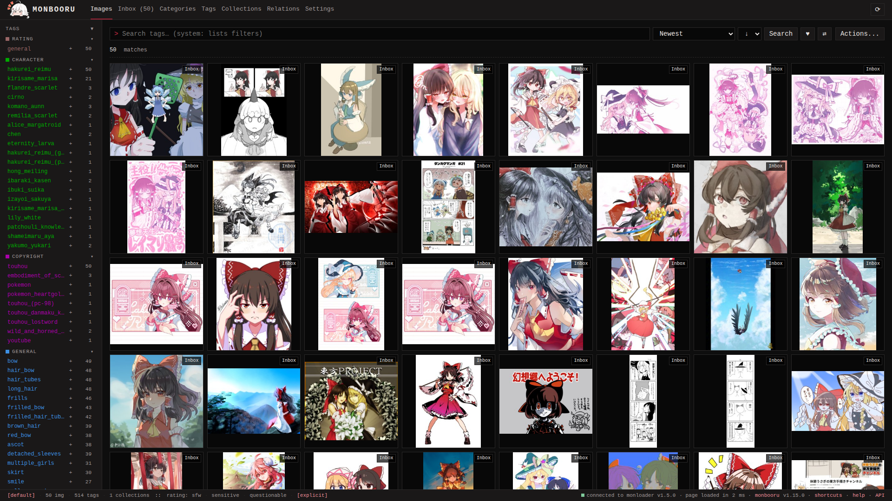

monbooru is a private booru you run on your own machine. A booru is a
tag-based image gallery: instead of sorting pictures into folders you
attach tags to them (`red_hair`, `character:hakurei_reimu`, `rating:general`)
and find things again by combining tags in a search.

It is built for organizing a local media collection: your own photos
and videos, downloaded art, manga archives, and AI-generated images.
Everything runs from a single small binary with one SQLite database
per gallery. Your files stay ordinary files on disk; removing monbooru
leaves them exactly where they were.

monbooru itself never touches the internet. Online features
(downloading from boorus, reverse image lookup) are handled by the
optional [addons](addons/_index.md).

> **Local network only.** monbooru is designed for a trusted home
> network or private VPN. It is not hardened for direct exposure to
> the public internet and provides no TLS or access control of its
> own; if you expose it, add those in front of it.

## What it does

- Tag-based gallery with a folder tree, favorites, saved searches,
  collections and rating tags with an SFW ceiling. See
  [Searching](guides/searching/index.md) and [Tags](guides/tags/index.md).
- A file watcher picks up new, moved and deleted files within
  seconds, and new images land in an [inbox](guides/inbox/index.md) for review.
- Reads Stable Diffusion metadata (A1111/Forge and ComfyUI): prompts,
  models, seeds, full workflows. See [AI metadata](guides/ai-metadata.md).
- Local [auto-tagging](guides/auto-tagger/index.md) with ONNX models (WD14
  SwinV2, animetimm EVA02, JoyTag, Camie v2) on CPU or GPU.
- Images, video, animated GIFs, plus CBZ/ZIP archives browsed as one
  object with a built-in [manga reader](guides/manga/index.md).
- [Relations](guides/relations/index.md) between images: duplicates,
  alternates, version chains, derivatives, with near-duplicate
  detection and a side-by-side review session.
- [Multiple galleries](guides/galleries/index.md) in one instance, each with
  its own files and database, plus export, import and
  [migration](guides/migrating.md) from other similar applications.
- Reverse [lookup](guides/lookup/index.md) of your images against boorus,
  IQDB/SauceNAO and the Hydrus PTR, through a paired monloader, and
  [contributing tags back](guides/ptr-contributions/index.md) to the PTR.
- A REST API with scoped tokens, covered in
  [Development](development.md).

## Where to go

- [Install](getting-started/install.md) gets it running with Docker; [First steps](getting-started/first-steps/index.md) to walk
  the UI.
- The [guides](guides/_index.md) cover the main features.
- [Configuration](configuration.md) has the environment variables,
  theming and advanced tagger setup.

## Addons

monbooru works on its own, and nothing in it depends on the other apps
being present. Two optional companions extend it:

- **[monloader](addons/monloader/_index.md)** adds the online half: it
  downloads posts from booru sites into your collection with their
  tags, and runs reverse lookups on images you already have to
  backfill tags and sources. monbooru stays offline; monloader connects to the internet.
- **[monsender](addons/monsender/_index.md)** is a browser extension
  that sends the page you are viewing, or images picked from it,
  straight to monloader's download queue. It needs monloader.

The [addons overview](addons/_index.md) explains how the pieces fit,
and the [quick start](addons/quick-start.md) adds both to a running
monbooru.
