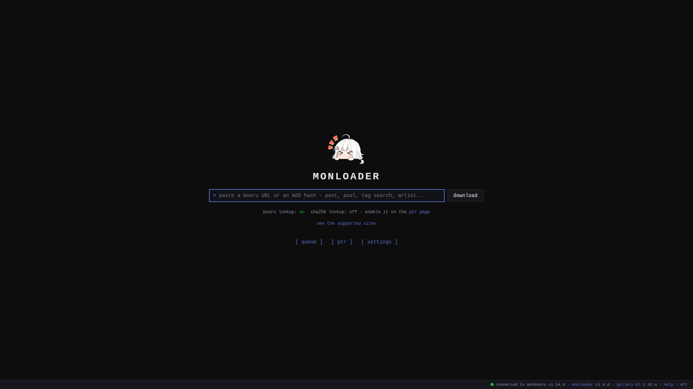

monloader is the downloader that feeds [monbooru](../../_index.md).
Paste the URL of a booru post, a pool, a tag search, an artist page, or a
direct image link; monloader fetches the files and their per-post metadata,
maps that metadata onto monbooru's data model, and pushes each file into a
monbooru gallery over its API.

The actual scraping is done by
[gallery-dl](https://github.com/mikf/gallery-dl), so any site gallery-dl
supports works. monloader adds the download queue, the metadata mapping, and
the push into monbooru, with curated profiles that sharpen the result for
50-plus known sites.

It also runs in reverse: for a file monbooru already holds, monloader can
find tags by file hash and by image similarity (IQDB, SauceNAO) across the
boorus, and optionally from a local copy of the Hydrus Public Tag
Repository, then fold them back into the image. See
[reverse lookup](guides/lookup/index.md).

The two apps stay separate on purpose: monbooru holds your files and needs
no internet access, while monloader has internet access but never touches
the gallery files - everything flows through monbooru's API. monloader is
intended for your local network; its UI is not designed to be exposed to the
public internet.

- [Install](getting-started/install.md) - run it in Docker or Podman next to monbooru.
- [Pairing](getting-started/pairing/index.md) - connect it to monbooru and to the monsender extension.
- [Downloading](guides/downloading/index.md) - the queue, outcomes, retries, pools and manga.
- [Sites and credentials](guides/sites/index.md) - site profiles, logins, cookies files.
- [Metadata mapping](guides/mapping.md) - how tags, ratings, and sources land in monbooru.
- [Reverse lookup](guides/lookup/index.md) - find tags for files you already have.
- [Hydrus PTR](guides/ptr/index.md) - the optional offline tag database.
- [Configuration](configuration.md) - the TOML file, environment variables, theming.
- [API and development](development.md) - tokens, error codes, building from source.
