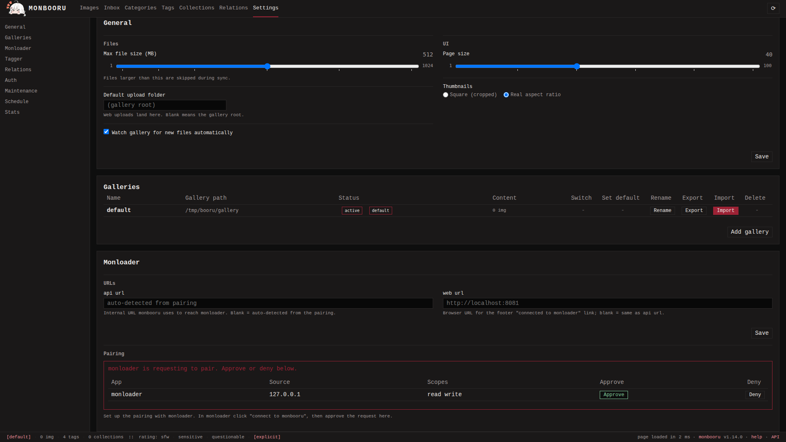
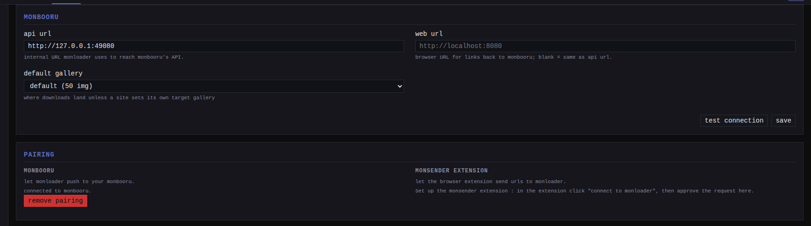

Pairing connects the apps without copying keys around: one side asks, you
approve on the other side, and a scoped API token is issued automatically.
The model is described once in
[pairing across the apps](../../../pairing.md); this page is the
monloader side of it.

monloader sits in the middle, so it pairs twice: with monbooru (approved on
the monbooru side) and with the monsender browser extension (approved on the
monloader side).

## Pair with monbooru

1. In monloader, go to **Settings -> monbooru** and confirm the **api url**.
   The default `http://monbooru:8080` works when both containers share
   monbooru's compose network.
2. In the **pairing** section, click **connect to monbooru**.
3. In monbooru, approve the pending request in its monloader settings.

   

4. Back in monloader, pick a **default gallery** (the dropdown appears once
   paired) and save.

   

Approving provisions tokens in both directions: monbooru issues monloader a
read and write token (stored as `[monbooru].api_token` in monloader's
config) so it can push images, and monloader issues monbooru a
`monbooru (paired)` token on its own API so monbooru can trigger lookups and
source refetches. The monbooru-side token cannot delete anything and never
touches gallery files.

## Pair with monsender

1. In the monsender extension's options, set monloader's URL and click
   **connect to monloader**. The extension-side steps are in
   [monsender setup](../../../monsender/getting-started/setup/index.md).
2. In monloader, approve the request under **Settings -> pairing**.
   Approving mints a scoped `monsender (paired)` token that the extension
   stores.

## Pausing the link

Clicking the connectivity dot in monloader's footer while it is green
holds the link: monloader stops calling monbooru and refuses new
downloads - a pasted URL and the browser extension alike - until you
click it again. The pairing itself is untouched. Requests coming the
other way (monbooru asking for tags or a refetch) still work, and
downloads already queued are not affected; monbooru's footer carries
the same switch for the other direction.

## Paired tokens

Paired tokens appear in **Settings -> Authentication**, but their scopes
are fixed and they cannot be revoked directly: remove the pairing
instead.

## Re-pairing

Removing a pairing (on either side) drops the local
token and asks the peer to drop its own; if the peer was unreachable at that
moment, a notice reminds you to remove it there too. monloader keeps the
configured monbooru api url, so a re-pair reuses it.

## Manual setup

If you would rather manage the monbooru token by hand, set
`[monbooru].api_token` in `monloader.toml` or the
`MONLOADER_MONBOORU_API_TOKEN` environment variable; there is no UI field
for it. The value must be a monbooru API token with read and write scope.
