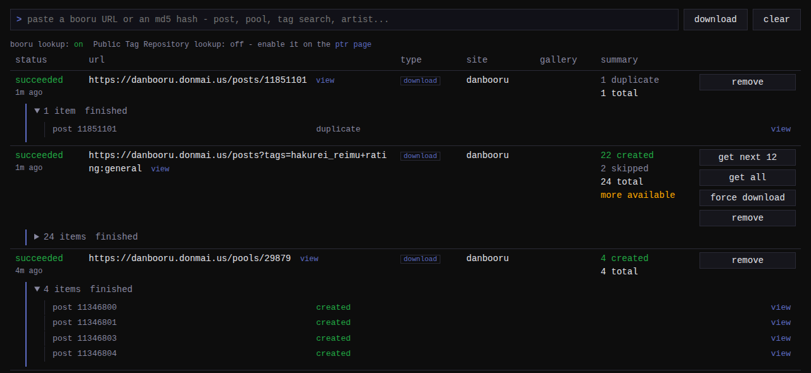

## Sending URLs to the queue

Paste a URL into the add bar and press Enter. Anything a gallery-dl
extractor matches works: a single booru post, a pool, a tag search, an
artist page, a manga or comic gallery, or a direct link to an image file.
The bar also accepts a bare md5 hash to import the booru post carrying
that file; see [tagging by hash](#tagging-by-hash) below.

Items can also reach the queue from the
[monsender extension](../../../monsender/guides/sending.md), which sends
the page you are browsing in one click, or from scripts POSTing to
`/api/v1/queue` with a bearer token (see
[API and development](../../development.md)).

A queued URL is a job. It is first resolved to the posts it expands to
(one job becomes one or more items); each item is downloaded, its
metadata [mapped onto monbooru's model](../mapping/index.md), and the
file pushed into the target monbooru gallery. Files are deleted from
scratch space once monbooru has accepted them; monloader keeps no copy of
anything.

## Per-item outcomes

Every item ends with one of eight outcomes:

| Outcome | Meaning |
|---|---|
| `created` | new image accepted by monbooru |
| `duplicate` | monbooru already had this exact file; any new tags merge in |
| `enriched` | a metadata-only refetch or a hash lookup merged tags into an image monbooru already holds |
| `matched` | a batch PTR lookup answered with an image's tags; monloader wrote nothing, monbooru applies them |
| `replaced` | the post's file was pushed over an existing image's, keeping its tags and history - this is monbooru's **[upgrade]** action doing its work through monloader (see [Lookup and sources](../../../../guides/lookup/index.md)) |
| `skipped_archive` | this post was already fetched before; not downloaded again |
| `skipped_unsupported` | monbooru cannot ingest this file type; not pushed |
| `failed` | something went wrong; the row shows the reason |

monbooru ingests jpg, png, webp, gif, mp4, webm, and cbz files; a download
of any other type (audio, svg, a document) is `skipped_unsupported` rather
than pushed and rejected. A `failed` item carries a stable machine-readable
error code; the full table is in
[API and development](../../development.md#error-codes).

## Large searches: the cap

A tag search or an artist page can expand to thousands of posts, so a job
takes at most `max_items_per_job` posts (default 200). A capped job offers
two follow-ups: **get next N** fetches the next window of the search
(N follows the cap down if you lower it afterwards), and **get all** keeps
fetching until the search runs short. A search and its continuations
collapse into one queue row with summed counts.

Booru pools and manga galleries are exempt from the cap: they are one work
you asked for as a unit and always come down whole.

## Retry, force, and cancel

- **retry** re-runs a job. For a bulk search that finished cleanly, posts
  already fetched are skipped (`skipped_archive`). A job that failed
  fetches everything again, because a post it had downloaded may never
  have reached monbooru.
- **force download** bypasses the archive skip and fetches
  already-fetched items again - useful to re-import a post whose image
  you deleted in monbooru. On a search that was continued, it covers
  every window the row counts, not just the last batch.
- Re-submitting a **single post** always re-fetches it: monbooru
  recognizes the file and merges any new tags into the existing image,
  so this is how you refresh one post from its source.
- **cancel** stops a job whether or not it has started; items still in
  flight end as canceled, finished ones keep their outcome.

The queue survives a restart: jobs that were still waiting resume, and a
job that was mid-download when the app stopped comes back marked
**interrupted**.

Finished rows get automatically removed after the delay windows set in  **Settings -> downloads**. You can set different windows for successful downloads and failed ones. Set
either to 0 to turn it off; in any case, rows still get removed once the queue's max limit of 100 pushes them out.

## Pause and resume

The pause button (also in the monsender popup) holds all downloads
globally: the job in flight finishes, then nothing new starts until you
resume. Use it to queue up a batch before letting it run. The pause does
not survive a restart: a restarted monloader starts unpaused, so anything
still pending begins downloading again.

## Pools and manga

Multi-page works are handled by kind:

- A **booru pool** (an ordered set of posts forming one work) imports as an
  ordered collection: each page is pushed as its own image under a shared
  collection label (the pool name) and page number, keeping each page's own
  tags.
- A **manga or comic gallery** is bundled, in order, into a single `.cbz`
  file (a comic book archive) and pushed as one file, which monbooru opens
  in its reader. The bundle's tags are the union across the pages and its
  rating the strictest seen. If any page fails to download, the job fails
  rather than pushing a truncated book.
- A **manga title** page that lists chapters imports each chapter as its
  own `.cbz`.

Some URLs list other pages rather than files - a forum thread whose images
are hosted elsewhere, an archive board. monloader follows these handoffs
and imports the files they lead to as loose items, bounded by the per-job
cap.

## Tagging by hash

Two features find a post from a file hash instead of a URL; both walk the
same [lookup chain](../lookup/index.md) and show up on the queue page as
jobs like any other:

- **Hash import**: paste a file's md5 (bare or as `md5:<hash>`) into the
  add bar and the matching booru post is imported like any single post.
- **Lookup enrich**: monbooru's lookup buttons ask monloader to find
  tags for an image it already holds and merge them in, without
  re-downloading the file.
