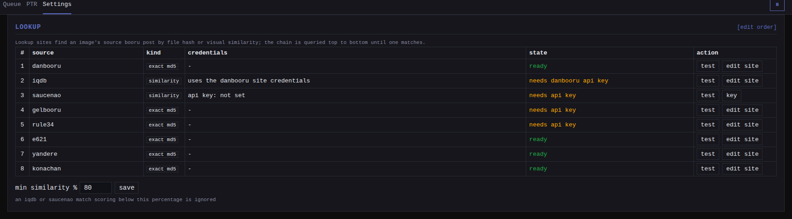

Reverse lookup answers "where does this file come from, and what are its
tags?" from the file itself, without a URL. monloader walks a chain of
sources you configure: exact hash searches on the boorus, image-similarity
services, and optionally the local [Hydrus PTR index](../ptr/index.md), and folds
what it finds back into monbooru.

You reach it two ways:

- **From monbooru**: the lookup actions on an image ask monloader to find tags for
  a file monbooru already holds and merge them in. The monbooru-side view
  is in [monbooru's lookup guide](../../../../guides/lookup/index.md).
- **From monloader**: paste a file's md5 (bare or as `md5:<hash>`) into the
  add bar to import the booru post carrying that file, like any single-post
  download.

Every lookup runs as a job on the queue page, so its outcome is visible like
any download.

## The lookup chain

The chain is one ordered list of sources, asked top to bottom; the first
source that answers wins. A source is one of two kinds:

- **An exact md5 search** on a booru that indexes file hashes. Precise, but
  it only matches the exact original bytes - a resized or re-encoded copy
  misses.
- **A similarity service**: danbooru's IQDB instance (`iqdb`) or SauceNAO
  (`saucenao`). These find visually matching posts, including re-encodes, by
  uploading the image's thumbnail and answering with candidate posts and
  0-100 scores. The best candidate at or above the **min similarity** floor
  (default 80%) is then fetched through gallery-dl like any pasted URL.

Out of the box the chain asks danbooru by exact md5 first, then IQDB, then
SauceNAO, then gelbooru, rule34, e621, yandere, and konachan by exact md5.

A source that is down or refuses does not kill the lookup; its error is
noted and the chain continues.

## Editing the chain

The Settings **lookup** section is the one place the chain is configured:
which sources are queried, in what order, and the similarity floor
(`lookup.min_similarity` in the TOML). Each chain row has a test button
that runs one real query with a built-in probe image, so "no match" is a
successful round trip; the SauceNAO test also reports your remaining daily
quota. The `iqdb` row's **edit site** button opens danbooru's dialog,
since IQDB borrows danbooru's credentials.

## Credentials

A source missing its credential is skipped at query time, so it costs
nothing until configured:

- `iqdb` uses the danbooru site credentials (username and api key from the
  danbooru row in [sites](../sites/index.md)): danbooru refuses anonymous IQDB
  uploads. The account must be at least Member level (email verified);
  danbooru denies uploads from restricted accounts even with a valid key.
- `saucenao` needs its own api key (free registration at saucenao.com; the
  free tier allows roughly 100 queries a day, and monloader backs off while
  the service reports its limit reached). Set the key via the **key** dialog
  in the lookup section.
- The exact md5 searches follow each site's normal auth kind - gelbooru and
  rule34, for instance, need their api key and user id.

## When a match cannot be fetched

A similarity service returns pointers, not tags, and sometimes the post it
points at cannot be fetched - a missing credential, a deleted post. The best
candidate is then still recorded as the image's **source**, with no tags,
and the queue row is marked `source only`. A confident hit outside the
supported sites (an anime database, a Pixiv or Twitter page) gets the same
treatment when no supported site matched: its URL is recorded as the source,
labeled by its host.

When no source holds the file at all, the item ends `hash_not_found`, and
its message lists every source asked and why it missed or was skipped. A
similarity service that found nothing usable lists its closest candidates
with their scores, so a near-miss stays visible and you can judge whether
the floor is too high.

## Hash import specifics

A pasted hash carries no image to compare, so a hash import uses the chain's
exact-md5 sources only; the similarity services are skipped. A pasted sha256
is refused: boorus index the md5 of the original upload. sha256 is the hash
the PTR backend keys on, and PTR lookups are driven from monbooru, not the
add bar.

## The PTR as a backend

With the [Hydrus PTR index](../ptr/index.md) enabled, monloader can also answer from
its local sha256-keyed copy of the PTR (offline, and covering files that
were deleted from the boorus or never posted there). monbooru drives it
per image (the PTR panel's **Pull tags**) or in batch.
