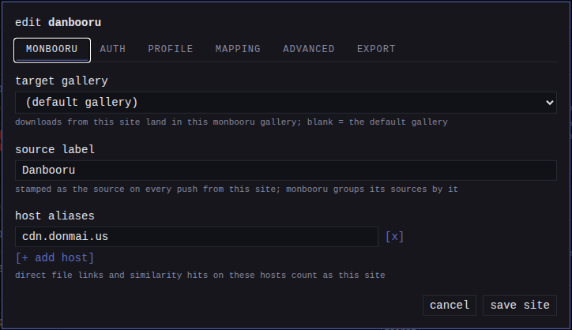
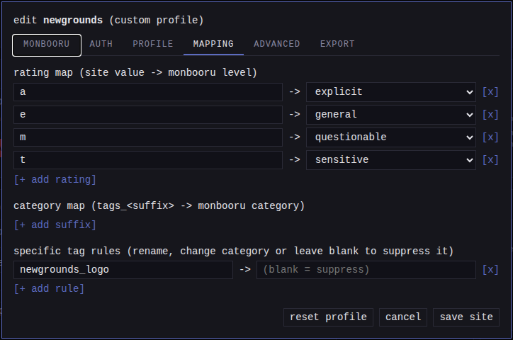

gallery-dl returns each post's fields in the source site's own vocabulary.
monloader translates that into what monbooru expects: tags sorted into
categories, a rating, a source label, and a canonical URL. The translation
is driven by per-site profiles (the shipped ones, or your own edits
layered over them) plus a generic fallback for everything else, with
override tables in the config for the edge cases.

## Tags by category

Boorus expose per-category tag lists, and each list is routed to the
closest monbooru category:

| Source tag category | monbooru category | Notes |
|---|---|---|
| general | general | |
| artist | artist | |
| character | character | |
| copyright | copyright | |
| meta / metadata | meta | gelbooru calls it `metadata` |
| species | species | |
| lore | meta | |
| contributor | artist | |
| circle / group | artist | doujin circle or group |
| parody / series | copyright | the parodied or source work |
| studio | copyright | production studio |
| model | person | real-person model (photo boorus) |
| faults (moebooru) | meta | |
| invalid, deprecated | dropped | not real tags |
| anything else | general | best-effort fallback |

Tag names are normalized to the form monbooru stores before they are
sent: lowercased, with spaces (and the two characters monbooru's search
reserves, `"` and `*`) folded to underscores and the ends trimmed
(`fate/grand order` becomes `fate/grand_order`).

monbooru auto-creates tags it has not seen before; any it rejects come back
as tag warnings, recorded on the queue item without failing the push.

## Rating

The full-word rating forms (general, sensitive, questionable, explicit,
and safe) map one to one on every site, case-insensitively, with safe
becoming general.

The catch is the single letter `s`: on Danbooru it means "sensitive", on
every other family it means "safe". monloader knows which family each site
belongs to, so the letter is read per family, not globally. A rating value
it cannot recognize leaves the image unrated; monbooru keeps unrated images
visible under every rating ceiling, so an unknown value is treated as safe
to show.

**NSFW manga.** Manga and comic galleries carry no per-post rating. Leaving
them unrated would surface them under a safe ceiling, so the profiles of
NSFW-only sites (nhentai, hitomi, exhentai, and similar) set a
`default_rating` of `explicit` that applies only when the source gives no
rating. A real source rating always wins.

## Source, URL, and gallery

| monbooru field | Value |
|---|---|
| `url` | the post's own page. Curated sites build it from the profile's post URL template (e.g. `https://danbooru.donmai.us/posts/{id}`); a site without a profile uses the page link the extractor reports, falling back to the URL you submitted |
| `source` | the site name, or the source label you set for the site, so filtering by `source:danbooru` works in monbooru |
| `via` | `monloader`, recorded as the image's origin and as the tagger of each pushed tag |
| target gallery | the site's per-source gallery, falling back to the default gallery |
| `collection` / `collection_order` | the pool name and page order, when a pool is pushed as a collection |

A direct link to a media file has no booru post behind it: the source is the
file's host and the URL is the file URL itself. The exception is a direct
file sent along with the page it was found on (monsender does this): the
page becomes the recorded URL and its host the source, so the image links
back to where you actually saw it rather than to a bare CDN address.

## One label per site

Depending on how a file arrives, its source would naturally read
differently - `danbooru` from the extractor, `cdn.donmai.us` from a direct
file link to the same site - and your monbooru sources list splits. Three
settings keep them under one name:



- **Source label**, on the site dialog's monbooru tab
  ([sites](../sites/index.md#the-edit-dialog)): the name stamped as the
  source on every push from that site. Blank keeps the site name.
- **Host aliases**, on the same tab: the extra hosts that belong to the
  site - file CDNs, mirror instances. A direct file link on one of them
  counts as the site and gets its label, a domain covers its subdomains,
  and monsender uses the same list to recognize the site when you send
  from a mirror.
- **Host labels**, below the sites tables: labels for hosts gallery-dl
  does not cover at all, such as a wiki you save files from.

A host nothing matches keeps its raw hostname. Labels apply to new pushes
only, so images already in monbooru keep the source they were pushed with.

## Commentary, original source, and notes

Danbooru-family posts carry the artist's commentary, and some families
carry positional note boxes overlaid on the image; both are pushed along,
notes with their pixel coordinates and formatting. Most boorus
also declare the post's original source - the upstream artist URL, such as
a Pixiv or Twitter page - and monloader pushes it as the origin's original
source. monbooru overwrites a source's commentary, original source, and
notes on each re-pull.

## Parent posts

A post that declares a parent (a booru parent/child pair, such as an edit
or a variant set) is pushed with the parent's post URL. Once both posts are
in the monbooru gallery - whichever arrived first - monbooru links the pair
as a derivative relation, with the parent as the source. Pairs already
related (or marked not related) in monbooru are left alone.

## Editing a site's profile

You can edit the profile for any site supported by gallery-dl: open the
site's edit dialog on the Settings page
([sites](../sites/index.md#the-edit-dialog)) and use its **profile** and
**mapping** tabs. A save applies immediately; the saved profile is one
JSON file, `/config/profiles/<site>.json`.



- **Family** picks the rating semantics and the tag regime (generic fits
  most non-booru sites); **kind** picks whether a gallery bundles into a
  cbz (manga).
- **Post URL template** and **md5 search template** are the site's
  canonical post page and hash-search URL, with `{id}` / `{md5}`
  substituted. Setting an md5 template makes the site usable in
  [reverse lookup](../lookup/index.md).
- **The rating map** routes a site's raw rating values to monbooru
  levels. This is the fix when a site's letters read wrong: a site that
  exposes `e` for "Everyone" would read as explicit by default.
- **The category map** reroutes a source tag category
  (`tags_<suffix>`) to a different monbooru category, or drops it.
- **Specific tag rules** correct individual tags: rename one (fix a
  persistent misspelling), retarget it with a `category:` prefix, or
  leave the replacement blank to suppress it entirely. Rules apply to
  everything the site sends: downloads, refetches, and hash lookups
  alike.
- The advanced tab's **public options** are gallery-dl options every
  user of this profile would want; options that include secrets go in
  the private options instead.

The file format is exactly what monloader ships, so sharing your profile
so it becomes the default is copying that file into a pull request adding
`internal/mapping/profiles/<site>.json` - see
[API and development](../../development.md#adding-a-site-profile).

## Override tables

`monloader.toml` also has override tables (not exposed in the settings
UI). An override wins over any profile and the built-in family rule, and
takes effect on the next download:

```toml
# route a source tag category to a different monbooru category for one site
[[tag_overrides]]
site = "e621"
from = "species"
to   = "general"

# route a source rating value to a monbooru rating for one site
[[rating_overrides]]
site = "somebooru"
from = "x"
to   = "explicit"
```

`site` is the gallery-dl category. A `tag_overrides` entry matches a source
tag category (its `from`) and reroutes it; a `rating_overrides` entry
matches a raw rating value (case-insensitively) and remaps it.
