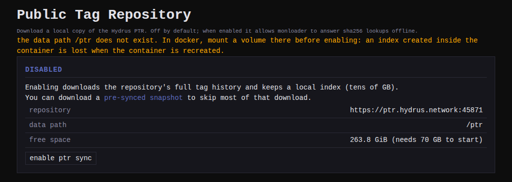
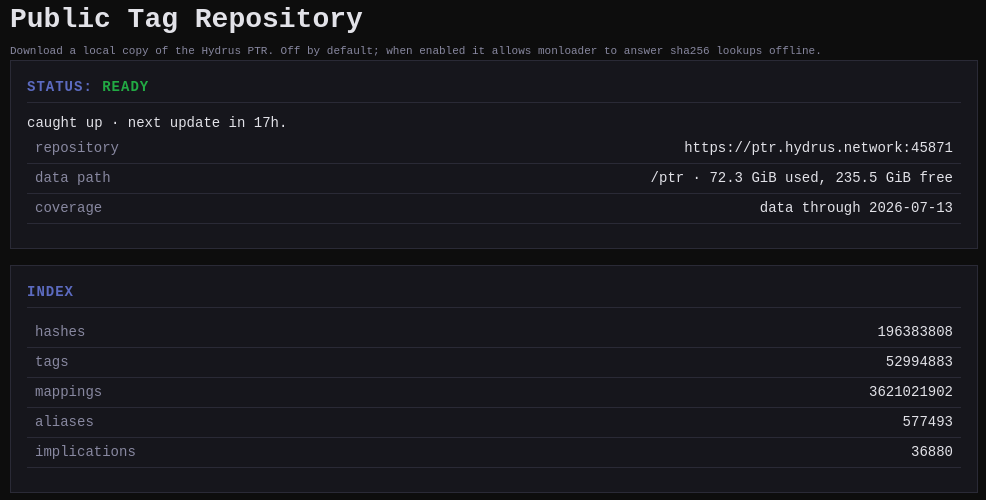

monloader can answer "what are this file's tags?" from the file's sha256
alone, using a local copy of the
[Hydrus Public Tag Repository](https://hydrusnetwork.github.io/hydrus/PTR.html)
(the PTR) - a community-maintained database of billions of tag-to-file
mappings. It is off by default and downloads nothing until you enable it.

This is the offline companion to the online [lookup chain](../lookup/index.md): the
booru lookup is instant and needs no local data, but only finds files still
hosted on a booru; the PTR also knows files that were deleted or never
posted there, at the cost of a large local index.

## What it costs

The PTR has no per-hash query API - by design, so its server cannot learn
which files you have. Using it means streaming the repository's whole tag
history once and keeping a local index:

- **Initial download**: thousands of update files, fetched and indexed
  over days.
- **Local index**: a database on its own volume (expect more than 70 GB).
  monloader refuses to start the initial sync when the volume has less than
  `min_free_gb` (default 70) free. Building the index writes all over the
  database rather than end to end, which a spinning disk serves poorly:
  on an HDD the initial sync can take weeks, so prefer SSD-backed storage.
- **Steady state**: one small update roughly every day once caught up.

The index is a rebuildable cache of public data: it can be deleted and
re-synced at any time.

## Enabling it



1. Mount a dedicated volume at `/ptr` (there is a commented block in the
   shipped `docker-compose.yml` and `monloader.container`). The PTR page
   warns while the data path does not exist: without a volume mounted there,
   the index lands inside the container and is lost when the container is
   recreated.
2. Open **PTR** in the top bar, check your free space against what the
   initial sync needs, and click **enable ptr sync**. Catching up takes
   days; you can **pause** and **resume** at any time and it picks up
   where it stopped.

To turn the lookup off without losing the index, untick **enable sync and
answer sha256 lookups** in the settings ptr section; **delete ptr data**
in the same section is what reclaims the disk.



## Starting from a snapshot

The initial sync is the slow part. To skip it, seed the index from a
snapshot: monloader's own index file with the replay cursor baked in, so
enabling picks up from the snapshot's date and only fetches the days
since.

1. Download the latest snapshot from the
   [Hydrus PTR tag mappings dataset](https://huggingface.co/datasets/Leqwin/hydrus-ptr-tag-mappings)
   on Hugging Face - a `ptr-snapshot-<date>.sqlite.zst` file (about 22 GB
   compressed). The published `SHA256SUMS` file is there to verify the
   download against.
2. Decompress it: `zstd -d ptr-snapshot-<date>.sqlite.zst`. It expands to
   about 68 GB, so make sure the volume has the room first.
3. With monloader stopped, put the file in the `/ptr` volume as
   `ptr.sqlite`. In docker the container runs as uid 1000, so
   `chown 1000:1000 ptr.sqlite` if the owner does not already match.
4. Start monloader and enable the PTR (if it was already enabled, it
   resumes on its own). It syncs the days between the snapshot and now,
   then reaches caught up.

## Using it

The index answers once it is caught up, and not before: a half-built copy
would answer a few of a file's tags as if they were all of them. While it
is syncing or paused, PTR lookups are refused and a combined lookup runs
the online boorus alone, saying so in its miss trail.

- **Tag lookup**: the PTR becomes a backend of the
  [reverse lookup](../lookup/index.md). monbooru shows its PTR lookup option only
  while monloader reports the index synced; each lookup appears as a job on
  the queue page.
- **Aliases and implications**: the synced alias and implication graph is
  queryable (up to 500 tags per call), so monbooru can sweep its own tag
  list and propose aliases and implications drawn from the PTR.

The tags come back in monbooru form: hydrus namespaces are mapped onto
monbooru categories (`creator:` to artist, `series:` to copyright, and
so on) and names are normalized the same way as
[downloaded tags](../mapping/index.md). Namespaces with no monbooru meaning -
the PTR is full of bookkeeping like `title:`, `filename:` or
`pixiv work:`, whose values are ids or prose rather than tags - are
dropped whole rather than leaking into your general category.

## Contributing back

The PTR is a donated community database. Once it is synced, you can also
give back the tags you curate by hand: push tags your images carry that
the PTR lacks, and petition tags that are wrong.

Contributing needs a personal PTR account, created from the
**account** card on the PTR page. The account is made anonymously from the
PTR itself; uploads are attributed to it on the server for some time and
then anonymized, and volunteer moderators (janitors) review your
suggestions. Losing the key means losing the account, so the card lets you
reveal your key to back it up. Creating an account never happens on its
own, and monloader only makes one.

You do the actual contributing from monbooru (see
[Contributing to the PTR](../../../../guides/ptr-contributions/index.md));
monloader uploads it under your account and keeps the record in the
**contributions** card. A send that failed part-way leaves its items
there with a retry.

## Configuration

The `[ptr]` block in `monloader.toml`; every key also has a
`MONLOADER_PTR_*` environment override, and these keys are also editable
from the settings page's **ptr** section:

```toml
[ptr]
enabled     = false
data_path   = "/ptr"                          # dedicated index volume
address     = "https://ptr.hydrus.network:45871"
access_key  = ""                              # empty = the public read-only key; a personal account key goes here
fetch_sleep = 1.0                             # seconds between update downloads
min_free_gb = 70                              # refuse the initial sync below this free space
commit_sleep = 1.0                            # seconds between contribution uploads
```
