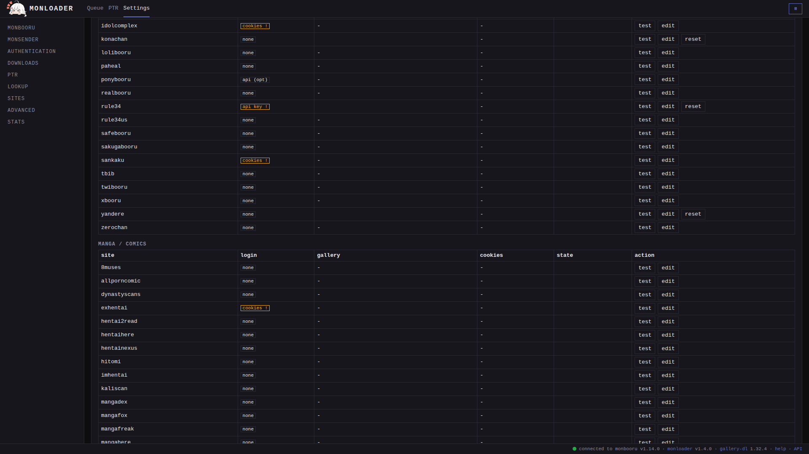
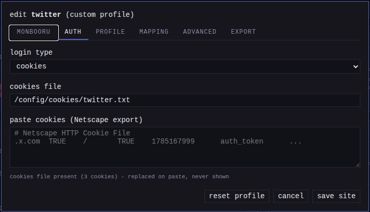

monloader does not parse any site itself; gallery-dl does. monloader ships
profiles tuned for known sites, falls back to a generic profile for
anything else gallery-dl supports, and lets you add, credential, and
correct any site from the Settings page.

## What the sites tables show

The sites tables list only the sites you have configured; they are your
configuration, not a list of what is supported. Every other site
gallery-dl supports still works the day you paste a URL from it - see
[gallery-dl's supported-sites list](https://github.com/mikf/gallery-dl/blob/master/docs/supportedsites.md).
To configure a site, add it with the search box above the tables.



## Auth kinds

The **login** column shows what each site needs; a marker flags a site
missing a credential it requires.

| Auth kind | Shown as | Meaning | Examples |
|---|---|---|---|
| `none` | `none` | Reads without credentials | most boorus, most manga sites |
| `api_optional` | `api (opt)` | Works unauthenticated at low rates; a key raises rate limits | danbooru |
| `api_required` | `api key` | Refuses to read without a key | gelbooru, rule34 |
| `username_password` | `user/pass` | Signs in with your account name and password | newgrounds |
| `cookies` | `cookies` | Needs a logged-in browser session exported to a cookies file | twitter, sankaku, exhentai |
| `oauth` | `oauth` | Authenticates through gallery-dl's own oauth flow; run it once and put the resulting tokens in the site's options | pixiv, reddit, deviantart |

For a site monloader has no profile for, the kind is read from
gallery-dl's site data as a starting point. If it guesses wrong (or the
site has no data), the [profile tab](../mapping/index.md#editing-a-sites-profile)
lets you set the correct auth type yourself.

## The edit dialog



**Edit** opens the site's dialog. Tab by tab:

- **monbooru**: pushes from the site land in the **target gallery**
  (empty = the default gallery). The **source label** and **host
  aliases** keep the site's pushes under one source name, covered in
  [metadata mapping](../mapping/index.md#one-label-per-site).
- **auth**: the login type and exactly the credentials it uses. Secrets
  are write-only - the page shows whether a value is set, never the
  value itself.
- **profile** and **mapping** edit how the site's metadata is
  translated - family, rating map, tag corrections, URL templates - see
  [metadata mapping](../mapping/index.md#editing-a-sites-profile).
- **advanced**: two JSON objects of extra
  [gallery-dl options](https://gdl-org.github.io/docs/configuration.html)
  for this site, the place for anything monloader has no field for.
  **Private** options may hold secrets like oauth tokens; **public**
  options are part of the shareable profile.
- **export**: the site's saved profile as the complete
  `profiles/<site>.json` file, ready to paste into an issue or pull
  request to share a fixed or new site (see
  [contributing a profile](../mapping/index.md#editing-a-sites-profile)),
  or to drop in another install's `profiles/` folder. It only contains
  what your profile changes against the built-in, and credentials never
  appear here.

**Test** runs a live probe against the site's example URL with your
configured credentials. A site still missing a required credential reads
"needs cookies" or "needs api key"; a credential the site refuses reads
"auth rejected"; a Cloudflare or captcha wall reads "blocked".

**Remove** undoes the whole dialog in one click - credentials, gallery,
source label, cookies path, options, and the site's own profile with its
tag corrections - and the row leaves the table. It leaves the site's
position in the [lookup chain](../lookup/index.md) alone: that is
configured in its own section, not here.

Saving a site rewrites the managed `gallery-dl.json` from the config; that
file is never hand-edited.

## Cookies

For a `cookies` site, export your logged-in browser session in the
Netscape `cookies.txt` format and paste it into the auth tab's **paste
cookies** box. Saving writes it as `<cookies_dir>/<site>.txt` (readable
only by monloader) and points the site at it; the page only ever shows how
many cookies the file holds, never their values. When the session expires,
export and paste again.

If you prefer managing the files yourself, set the path field instead:

```toml
[[sites]]
name    = "sankaku"
cookies = "/config/cookies/sankaku.txt"
gallery = "default"
```

## The equivalent TOML

The Settings rows write `[[sites]]` blocks in `monloader.toml`; you can
edit them directly instead. `name` is the gallery-dl category:

```toml
[[sites]]
name         = "gelbooru"   # gallery-dl category
api_key      = ""
user_id      = ""
gallery      = "art"        # per-source target; empty = default gallery
label        = "Gelbooru"   # source label on every push; empty = the site name
lookup_order = 4            # lookup-chain position; 0 or absent = not queried

[[sites]]
name     = "twitter"
cookies  = "/config/cookies/twitter.txt"
options  = '{"retweets": false}'   # extra gallery-dl options for this site
```

`lookup_order` decides whether (and when) the site is searched when finding
tags by hash; the chain is edited from the Settings lookup section and
explained in [reverse lookup](../lookup/index.md). The rest of the file is covered in
[configuration](../../configuration.md).
