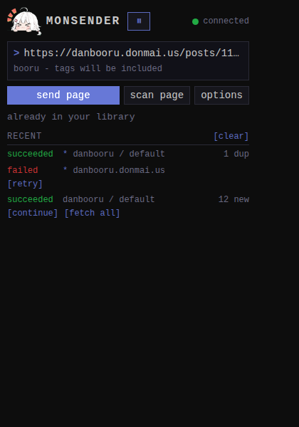

monsender is a browser extension for Firefox and Chrome that sends
things to your [monloader](../monloader/_index.md) download queue:

- the page you are viewing, with one click or a keyboard shortcut;
- an image or video you right-click;
- images you pick from a scan of the page.

monloader then downloads the files and pushes them into monbooru, your
self-hosted booru (an image gallery organized by tags).

The extension talks only to your monloader server. It never contacts
the boorus, monbooru, or anyone else; monloader does the downloading
server-side. When you send a post page from a supported site, the
image arrives in monbooru with its tags. When you send a direct image
file, it arrives without tags. The [sending guide](guides/sending.md)
explains the difference.

## In this section

- [Install](getting-started/install.md) - Firefox, Chrome, or a
  sideloaded .xpi.
- [Setup](getting-started/setup/index.md) - point it at your monloader and
  pair.
- [Sending pages and images](guides/sending.md) - the three ways to
  send.
- [Scanning a page](guides/scanning/index.md) - pick images from a page in
  the side panel.
- [The queue view](guides/queue.md) - watch and manage downloads from
  the popup.
- [Settings](settings/index.md) - every option explained.
- [Troubleshooting](troubleshooting.md) - connection states and error
  messages.
