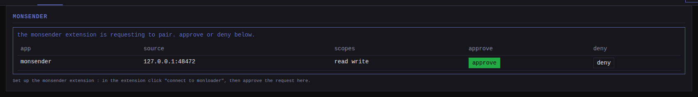
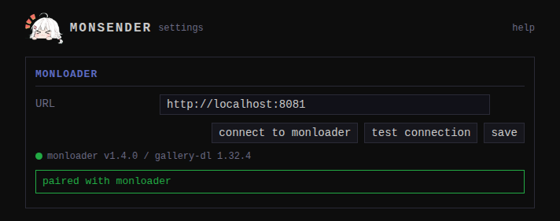

Setup is two steps: tell the extension where your monloader is, then
pair with it.

## 1. Set the monloader URL

Click the monsender toolbar button, then **options** (or right-click
the button and open the extension options). In the **monloader**
section, enter the base URL your browser reaches monloader at:
`http://localhost:8081` if it runs on the same machine, or a LAN
address like `http://monloader.lan:8081`.

Use the address as you would type it in the address bar, scheme
included. Plain `http://` is fine on a home network.

## 2. Allow access to that one address

When you click **save** (or **connect to monloader**), the browser
shows a permission prompt asking to allow access to that one origin
(the wording varies by browser). 

If you decline, the options page shows a warning that monloader cannot
be reached until you allow it. Nothing is broken; click **save** or
**connect to monloader** again to get the prompt back, and accept it.

## 3. Connect to monloader

Click **connect to monloader**. This is the only way the extension
gets its access token; there is no field to paste one into.

1. The extension sends a pairing request to your monloader.
2. Open monloader in another tab, go to **Settings -> monsender**, and
   approve the pending request.

   

3. The extension polls until the approval lands, stores the issued
   token, and shows "paired with monloader" with a green connection
   dot.

   

If you deny the request in monloader, or let it expire, the options
page says so; click **connect to monloader** again. The wait
times out after about a minute and a half if nothing is approved.

This is the same pairing model all three apps use; see
[how pairing works](../../../pairing.md).

## Check it worked

Click **test connection**. A green dot with the monloader and
gallery-dl versions means you are set. "token rejected" or
"unreachable" point to [troubleshooting](../../troubleshooting.md).

## If you change the URL later

The token is bound to the monloader instance that issued it. Saving a
different URL clears the stored token, so the old key is never sent to
a different server. Click **connect to monloader** again to pair with
the new instance.

Next: [sending pages and images](../../guides/sending.md).
