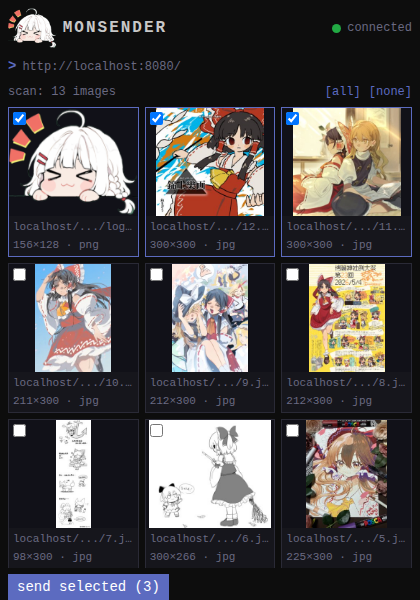

When a page holds many images and no supported extractor - a forum
thread, a blog post, an image dump - scan it and pick what to keep.

Open the popup and click **scan page**. The extension reads the images
out of the current page and opens the chooser beside the page: Chrome's side panel
on Chrome, the sidebar on Firefox. Because the chooser is docked, it
stays open while you scroll the page to cross-check.

Some pages cannot be read at all - browser-internal pages, the add-on
store, the built-in PDF viewer. The chooser says "this page cannot be
scanned" for those, which is a different answer from "no images found"
on a page it read and came up empty on.

Almost everything a scan finds is a direct file URL, so scanned images
arrive in monbooru untagged (see
[tagged or untagged](../sending.md#tagged-or-untagged-what-arrives)).

## The chooser

The panel shows the scanned page's URL, a count, and a thumbnail grid
with a checkbox on each image:

- **[all]** and **[none]** select or clear everything at once.
- **send selected (N)** at the bottom sends your picks. They are
  queued one at a time; the message under the button tracks progress
  and the [queue view](../queue.md) shows the jobs. If some fail to
  queue, the message says why ("sent 0 of 5; 5 failed - monloader
  rejected the token") and the selection is kept so you can send again
  once the cause is fixed (re-sending the ones that made it is
  harmless - they come back as duplicates).
- Tiny images are already filtered out: anything smaller than the
  **min image size** setting (64 pixels by default) is dropped, which
  removes icons, buttons, and tracking pixels. Set it to 0 in
  [settings](../../settings/index.md) to see everything.
- File types monbooru cannot store are left out too, so the chooser
  never offers a download that is refused before it starts. It lists
  jpg, png, gif and webp images and mp4 and webm video; svg, avif, bmp,
  tiff and heic pictures, and mov, mkv, avi, ogv and m4v video, do not
  appear. A URL with no file extension at all is still listed, since
  most CDN images carry none and only monloader can tell.

## Picking a resolution

When the page offers an image in several sizes, the card shows one
token per resolution ("1500w", "800w", "src"). The largest is selected
by default; click a smaller one to send that variant instead. A token
reading "src" is one the page gave no width for; pick it and it
relabels itself with the real width once that version loads.

## The scan cap and "showing N of M"

A scan lists at most the configured **scan cap** (100 by default, up
to 1000). When a page holds more, the header reads "scan: 100 of 350
images" so a truncated scan is never mistaken for the whole page.
Raise the cap in [settings](../../settings/index.md) if you routinely scan
bigger pages.

## Previews

Thumbnails are loaded straight from wherever the images live, by your
browser, exactly as if the page displayed them - with three guards: no
referrer is sent (cookie behavior follows your browser's third-party
cookie policy), they load lazily as you scroll the grid, and the grid
asks for the smallest version each image offers rather than the full
one. So scrolling a hundred-image page costs about what the page
itself cost, not a hundred originals - while the card still sends the
big version you picked. Video cards contact nothing until they scroll
into view.

If you would rather the chooser contact no outside host at all, turn
off the **previews** checkbox in [settings](../../settings/index.md). Cards
then show the file name instead of a thumbnail, and picking works the
same.

With previews on, a blank tile marked "preview blocked" means the host
refused to serve the image outside its own site (hotlink protection).
The tile names the file it will send, and if the image comes in several
sizes, picking another one loads that version instead. You can select
and send a blocked card either way; monloader may or may not be able to
fetch it, and the queue outcome will tell you.
