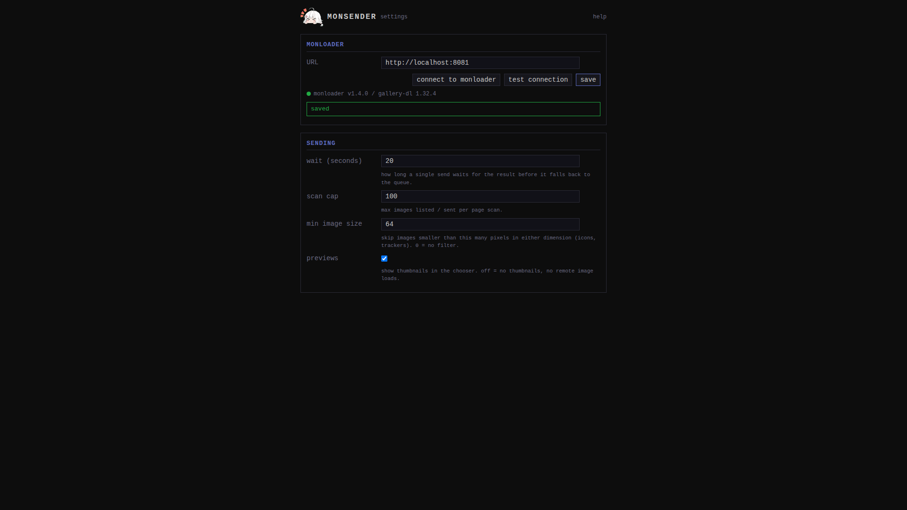

Open the popup and click **options**, or right-click the toolbar icon
and open the extension's options. Everything is stored locally in
your browser.

## monloader

- **URL** - the base URL your browser reaches monloader at, for
  example `http://localhost:8456` or `http://monloader.lan:8456`.
  Saving asks the browser to allow access to that one origin, then
  tests the connection. Changing the URL clears the stored token
  ([setup](../getting-started/setup/index.md#if-you-change-the-url-later)).
- **test connection** checks reachability and, when a token is
  stored, that monloader accepts it. The token belongs to the
  instance that issued it and is never sent to a different host, or
  shown; **token: set** beside the indicator says whether one is
  stored.

What the connection indicator's states mean is covered in
[troubleshooting](../troubleshooting.md).

## Sending

- **wait (seconds)** - how long a single send waits for its result
  before falling back to the queue. Within the window the popup shows
  the real outcome ("added", "already in your library", ...); past
  it, it shows "queued" and the [queue view](../guides/queue.md)
  takes over. Default 20, maximum 60, 0 means do not wait.
- **scan cap** - the most images a
  [page scan](../guides/scanning/index.md) lists and sends. Default
  100, maximum 1000. A truncated scan says so ("scan: 100 of 350
  images").
- **min image size** (up to 4000) - a scan skips images smaller than
  this many pixels in either dimension, which drops icons and
  tracking pixels. Default 64; 0 turns the filter off.
- **previews** - show thumbnails in the scan chooser. On by default.
  Off means the chooser loads no remote images at all and shows file
  names instead; see
  [previews](../guides/scanning/index.md#previews).
