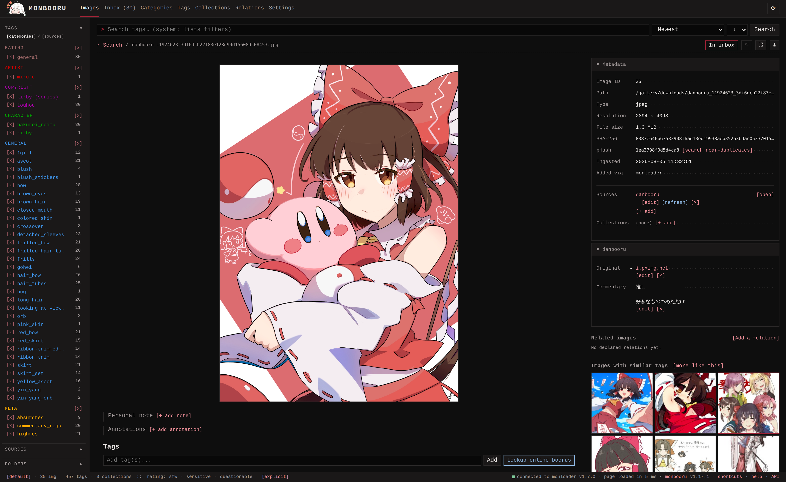
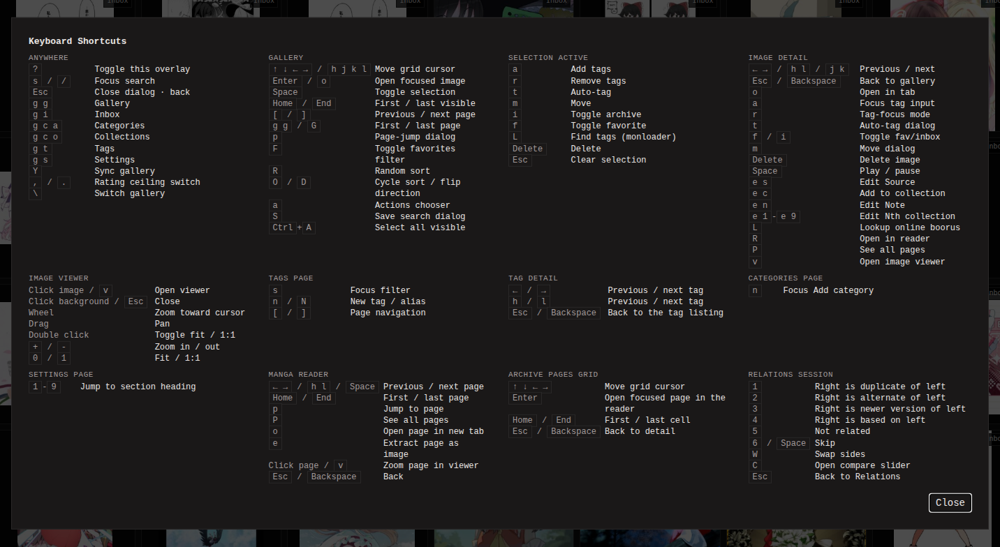

You have monbooru running and an empty gallery. This page walks the
basic loop once, with a handful of images: add them, tag them, find
them by search, and archive them. Each step has a fuller guide page; the
links point there.

## Add a few images

Two ways in:

- **Copy files into the watched folder.** The default gallery reads
  `/gallery` (whatever host folder you mounted there). Copy files in,
  and the watcher indexes them within seconds. Files that were already
  in the folder before monbooru started are picked up by a sync: click
  the sync icon at the top right. Subfolders are fine; monbooru keeps
  your folder structure and shows it as a tree in the sidebar.
- **Upload from the browser.** Open **Inbox** in the top menu and drop
  files into the drop zone.

Accepted formats are JPEG, PNG, WebP, GIF, MP4, WebM, and CBZ/ZIP
comic archives. The same file added twice (even under two different
paths) is recognized by its checksum and stored once.

Either way, new images land in the
[inbox](../../guides/inbox/index.md), the pile of things you have not
reviewed yet.

## Open one and tag it

Click a thumbnail to open its detail page: the image, its tags, and
the file's metadata.

Type a few tags into the tag input, separated by spaces: what is in
the picture (`red_hair`, `beach`), who made it (`artist:"john doe"`),
anything you will want to search by later. Add a rating tag too
(`rating:general` up to `rating:explicit`) to say how safe the image
is to have on screen. [Tags](../../guides/tags/index.md) has the full
syntax and how ratings work.

If you want to speed up the process, the
[auto-tagger](../../guides/auto-tagger/index.md) runs an image-tagging
model locally, on your own CPU or GPU, and tags your collection for
you.

## Search for it

The search bar combines tags and filters:
`red_hair -sketch rating:general` finds images tagged `red_hair`, not
tagged `sketch`, rated general. The full syntax is in
[Searching](../../guides/searching/index.md).

Everything in the sidebar (the tags on the current page of results,
top sources, your folder tree, saved searches) is clickable and
narrows the search. Checking thumbnails in the grid brings up a batch
bar with actions that apply to the selection, and on a detail page the
arrow keys walk the previous and next result of the current search.

The footer carries the SFW ceiling: click a rating level to hide
anything ranked above it (convenient when someone is looking over your
shoulder).

## Archive what you reviewed

Once an image's tags and rating look right, flip it from inbox to
**archived**: press `i` on its detail page, or select a batch of
thumbnails and flip them from the batch bar.

## Cheatsheets in the app

- Type `system:` in the search bar to open a dropdown listing every
  search filter, with drill-down hints for each one.
- Press `?` on any page for the keyboard shortcuts overlay. The UI is
  fully keyboard-drivable, from grid navigation to batch actions.
- The `help` link in the footer opens this documentation.

## Where next

- [Searching](../../guides/searching/index.md),
  [Tags](../../guides/tags/index.md) and the
  [inbox](../../guides/inbox/index.md) cover the loop above in detail.
- [Manga and comic archives](../../guides/manga/index.md) if your
  collection includes CBZ/ZIP archives.
- [Galleries](../../guides/galleries/index.md) to keep a second,
  separate library (say, wallpapers apart from art).
- The [addons](../../addons/_index.md) add the online half:
  downloading from boorus and reverse image lookup.
