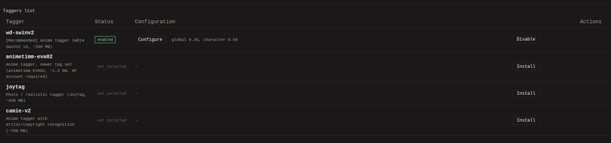
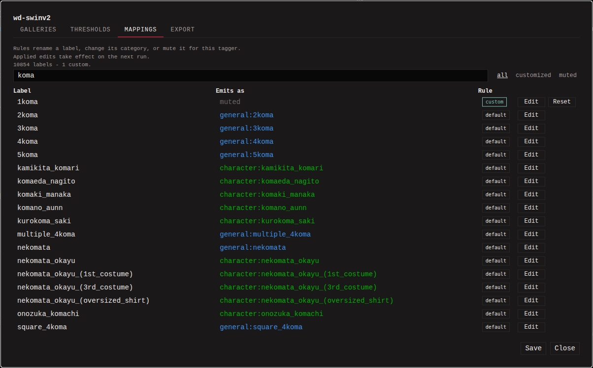

The auto-tagger runs ONNX image-tagging models locally against your
collection and applies the tags they suggest. Nothing is sent
anywhere: inference happens on your own CPU or GPU. It is disabled by
default.

Auto-tags are kept apart from your own: they carry the tagger's name,
show in their own group on the detail page, and can be stripped per
tagger later without touching manual tags.

## Install a tagger from the catalog

1. Open **Settings -> Auto-Tagger** and click **Install** on one of
   the suggested models (WD14 SwinV2, animetimm EVA02, JoyTag, Camie
   v2).
2. On a desktop install the dialog gives you a download link per file
   and a button that opens the folder they belong in. Save them there
   under the names they download with. On Docker it gives you shell
   snippets instead, for a host install or a `docker exec` install; run
   one on a machine with internet access and it drops the files into the
   `models` volume.
3. Refresh the Settings page and click **Enable** on the row.

**Configure** works while a tagger is disabled, so you can tune it
before turning it on. ONNX models outside the catalog work too; see
[Configuration](../../configuration.md#custom-onnx-models).

## Configuring a tagger

### Galleries

Which galleries the tagger runs on (default: all). Useful when one
gallery holds anime art and another holds photos and you do not want
an anime-trained model firing on the photos.

### Thresholds

Each tagger has a global confidence threshold: predictions scoring
below it are dropped. Per category you can override it - for example,
raise `character` to 0.85 to suppress false-positive character tags
while keeping `general` permissive. Categories the model only reaches
through mapping rules say "via rules".

**Max tags** caps how many tags the tagger may emit per category on
one image, keeping the highest-scoring ones. Empty cells use the
built-in defaults (`character` 8, `person` 8, `species` 8,
`copyright` 4, `artist` 4, `medium` 4, `general` 25, `rating` 1,
`year` 1, anything else 10); `0` means uncapped. Unticking **Enable**
mutes a category entirely, the way to run a tagger for only the
categories you want.

When several taggers are enabled they all run and their results are
merged: a tag detected by two taggers is inserted once, with the
higher confidence.

### Mappings

The model's full tag list, each label with what it turns into
(`category:name`). Edit a row to change its category, rename it, or
mute it so the tagger never emits it - the way to silence a label the
model learned wrong. Rules take effect on the next run.

Your rules are stored as `dispatch.json` next to the model file; see
[Configuration](../../configuration.md#label-dispatch-dispatchjson) for
the format.

### Export

Your mapping rules and model profile as files, changes highlighted,
exportable as clean JSON. Fixing a wrong label for everyone is
copying this over the matching file in the monbooru repository, or
dropping it next to `model.onnx` on another install.

## Running it

- **One image:** the **Auto-tag** button next to the tag editor.
  Single-image runs always use the CPU, even with GPU enabled
  (loading a model onto the GPU for one image would take longer than
  the tagging).
- **A selection:** check thumbnails and pick **Auto-tag** in the
  batch bar.
- **A whole search:** the gallery's **Actions** chooser applies to
  every match of the current search. To catch up on everything the
  tagger has not seen, run it on `autotagged:false`. A search
  matching more than 50,000 images is refused; narrow the query and
  run in slices.
- **Nightly:** turn on **Run enabled auto-taggers** in
  **Settings -> Schedule** (off by default).

Batch runs show progress in the status bar and can be cancelled.

## Videos and archives

A video is tagged from 5 sampled frames, a comic archive from every
page, and the per-frame results are merged into one set of tags for
the whole item. A label must show up on more than one frame to
survive the merge (scaled with length and capped at 10 frames), so a
single noisy hit on a 200-page manga is not enough while a label seen
on 10+ pages lands. The confidence threshold then applies to the
label's mean score. The gate is tunable via
`tagger.aggregation.min_hit_fraction`; see
[Configuration](../../configuration.md).

## Going further

GPU setup (execution providers), worker counts, custom ONNX models
with a `tagger.json` sidecar, remapping model labels with
`dispatch.json`, and the tagger's memory behavior are covered in
[Configuration](../../configuration.md).
