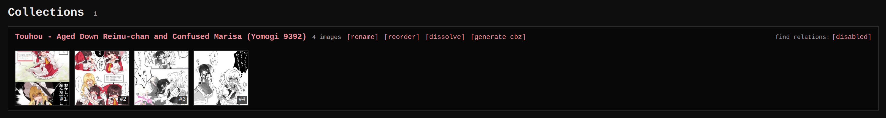

A collection is a named, (optionally) ordered set of images: a comic told in
loose pages, a photoset, an artist's series. It is a lighter grouping
than a [relation](../relations/index.md) - no original, no direction, just
membership and an order. An image can belong to several collections at
once, with its own position in each.

On the detail page, images from the same collection render in a
"Same collection" strip, so you can read through a set in order.

## Filing images

File an image from the **Collections** row on its detail page: the
name autocompletes against existing collections, and a new name
creates one. To file or unfile many images at once, use **Set
collection** in the gallery's Actions chooser (whole current search)
or the batch bar (selection).

## The Collections page

The Collections page lists every collection with its member count.
From there you can:

- **Rename** a collection across all its members. Renaming onto a name
  that already exists merges the two: the incoming members keep their
  order and land after the target's last page, so neither reading order
  is scrambled.
- **Reorder** members. In the reorder dialog, clicking a tile's
  filename also renames that file on the spot: type the new name and
  press Enter (Escape cancels).
- **Dissolve** a collection: the images stay, the grouping goes.
- Toggle **find relations** per collection. By default the
  near-duplicate pair finder skips pairs that share a collection
  (the collection already relates them); the switch opts a collection
  back in. See [Relations](../relations/index.md#finding-candidate-pairs).

## Searching and sorting

`collection:"name"` finds a collection's members, `collection:` images
in no collection, `collection:any` images in at least one. The
**Collection order** sort groups results by collection and reads each
one in its own order; when the search pins a single `collection:`,
results follow exactly that collection's order. Details in
[Searching](../searching/index.md#folder-source-collection).
