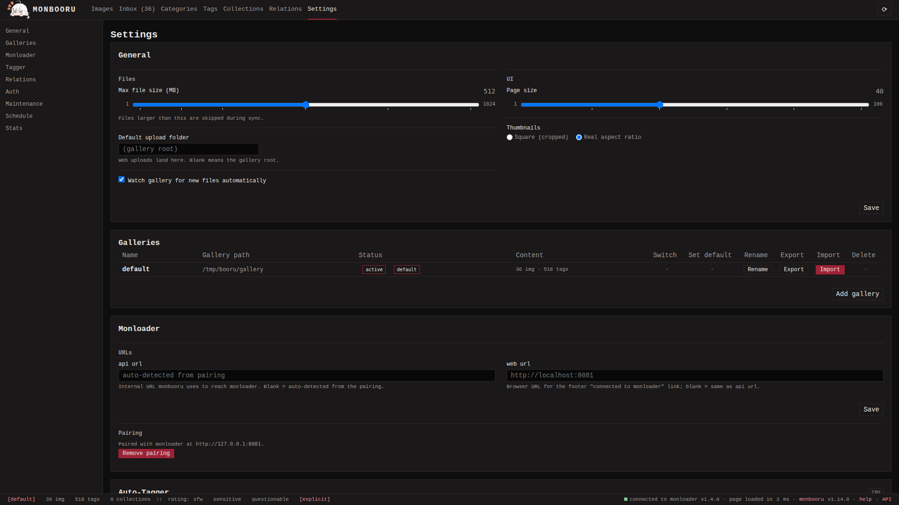

A gallery is a named folder plus its own database and thumbnails. Each
gallery is fully independent: its own images, tags, saved searches,
collections and relations. One instance can hold several - art in one,
photos in another - and the footer shows which one is active; click
the name to switch when more than one is configured.

Galleries are managed at **Settings -> Galleries**. The non-obvious
points:

- **Add** takes a name and a path on disk (with Docker, a folder you
  mounted into the container), and also accepts an import file
  (.db / .sqlite / .json / .zip) so you can create a populated
  gallery in one step.
- Switching the active gallery is per session; the default gallery is
  restored on restart.
- **Delete** erases the database and thumbnails but leaves the source
  images unless you also tick the folder option. The active, default
  and last remaining gallery cannot be deleted - switch or demote
  first.

## Export

Each gallery row has an **Export** with three formats:

- **db**: a consistent SQLite snapshot of the gallery database. The
  format to pick for a backup.
- **json**: one JSON document with every table, relations and
  collections included. Same fidelity, human-readable.
- **light**: a portable `tags.json` listing `{sha256, path, tags}` per
  image, with everything monbooru-specific (SD/ComfyUI metadata, saved
  searches, tag attribution, manga metadata) stripped. Useful as a
  tags-only backup or as input for other software. Only images present
  on disk are listed.

Tick **with images** to bundle the chosen format plus every file under
the gallery into a `.zip`. Thumbnails are excluded; they rebuild
after import. A db or json export without images carries
metadata only.

## Import

**Import** accepts a `.db`, `.sqlite`, `.json` or `.zip` produced by
Export, or a foreign format by another supported application (see [Migrating](../migrating.md)). A `.json`
upload can be a full export or a bare light `tags.json`; monbooru
detects which.

Two modes:

- **Merge** (preselected) adds new images and tags from the upload to
  the target gallery. Existing rows are kept; tags from the upload are
  layered onto matching images (matched by SHA-256). A `.db` or
  `.json` upload carries no image bytes, so on its own it applies tags
  only; new images arrive only from a `.zip` that bundles files.
- **Replace** wipes the target gallery's database and thumbnails, then
  loads the upload into the empty gallery. When the upload bundles
  image files, the gallery's source folder is wiped and repopulated
  too; a bare `.db` / `.json` leaves the source files in place. You
  type the gallery's name to confirm. Refused on the active and the
  default gallery (switch or demote first).

After an import monbooru switches to the imported gallery and rebuilds
its thumbnails in the background. Import is refused while any
background job is running. An imported entry whose file is not on disk
still lands as a tagged row flagged missing; find those with
`missing:true`. Files inside an archive are capped at the configured
`max_file_size_mb`, the whole upload at 16 GiB.

## Transfer

To move a few images to another gallery without an export/import
cycle, use **Transfer**. It appears on the detail page and in the
gallery batch bar (selection or whole search) whenever more than one
gallery is configured.

The image is copied into the target gallery and re-ingested there, so
it gets a fresh id and thumbnail. Its tags, rating, sources (each with
its artist commentary and original link), annotations, note and
favorite come along. If the target already has the same file (matched
by SHA-256), the transfer merges tags and provenance into that row
instead of duplicating it, without overwriting a note or favorite the
row already has.

Relations and collections are not carried over: they point at other
images that may not exist in the target. The transferred image lands
in the target's inbox for you to re-file. Tick **Remove from this
gallery after transfer** to move instead of copy; the source is
deleted once the copy succeeds.
