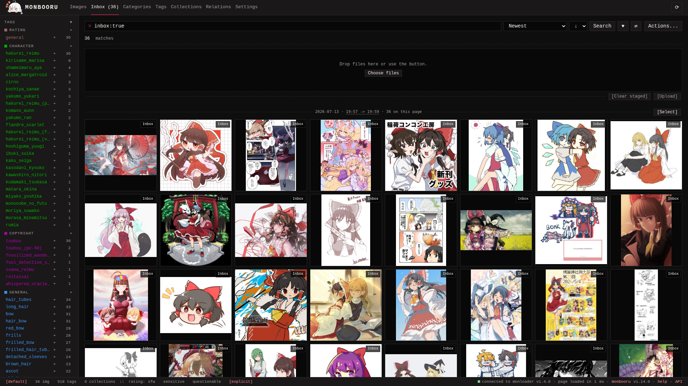

Every newly added image lands in the **inbox**, whether it came from
the watcher, a sync, a browser upload, the API or monloader. The inbox
is the "not reviewed yet" pile; once you have checked an image's tags
and rating, flip it to **archived**. Nothing forces you to triage, but
the split keeps "stuff I just downloaded" from mixing into your
curated library.

Open the inbox from the top menu; the entry shows the current count.
It is a regular search (`inbox:true`), so every search filter and sort
combines with it.

## Uploading

While you are on an inbox search, a drop zone sits at the top of the
grid. Drag files in or pick them with **Choose files**. Accepted
formats: JPEG, PNG, WebP, GIF, MP4, WebM, and CBZ/ZIP comic archives.
Duplicate filenames are auto-suffixed; a file you already have (same
checksum) is recognized and not stored twice.

While a file transfers the zone shows the percentage sent, then
switches to **Processing...** while monbooru files it - useful when a
multi-gigabyte comic archive takes a while to cross the network.

## Flipping between inbox and archived

- **One image:** the detail page has an **In inbox** / **Archived**
  button left of the favorite star (keyboard: `i`).
- **Many images:** the gallery's Actions chooser and the selection
  batch bar each carry a **Toggle inbox** entry that flips every
  targeted row - inbox rows become archived, archived rows become
  inbox.

## Batch clusters

While the gallery is sorted newest-first on an `inbox:true` search,
rows are grouped into batches with a header above each group. Each web
upload (one drop) is its own batch; files that arrived on disk are
grouped by time, with a new group starting after 15 minutes of
inactivity.

Each header shows the batch's date, time range and count, plus
**Select** / **Unselect** buttons that tick the whole group into the
batch bar - so "tag everything from this download, then archive it"
is two clicks. The time-range label is also a link to a search that
pins exactly that batch, useful when a batch spills across pages.
