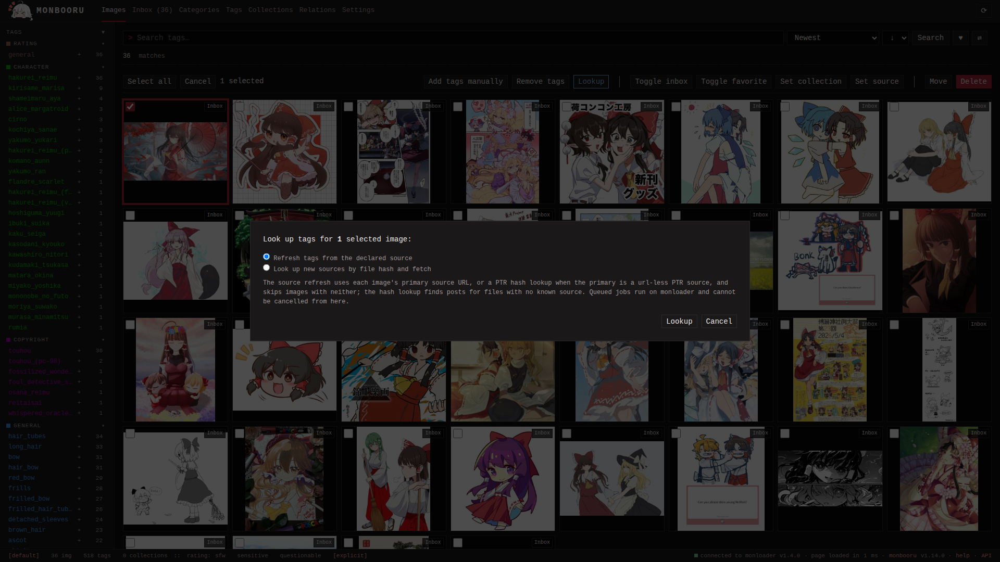

A lookup reverse-searches one of your images against external sources
to backfill its tags and sources: "where does this picture come from,
and what do other people tag it?".

monbooru itself never goes online. Every lookup runs through a paired
[monloader](../../addons/monloader/_index.md) instance, so set one up and
pair it first - see [Pairing](../../addons/pairing.md). The actions
below stay hidden until the pairing is live. How the lookup chain
itself works (which services are asked, in which order, similarity
floors) is documented on the
[monloader lookup page](../../addons/monloader/guides/lookup/index.md).

## What a lookup searches

Two backends, together or alone depending on what monloader has
enabled:

- **Online boorus and similarity services**: matches the file by its
  md5 hash on booru sites, and by image similarity through IQDB and
  SauceNAO. A booru hit records a new source on the image and merges
  in its tags.
- **Hydrus Public Tag Repository (PTR)**: matches the file by its
  sha256 against monloader's local PTR index. Only available when
  monloader has the PTR enabled. Pulls the matched post's tags.

Boorus index the original file's hash, so a resized or re-encoded copy
usually misses on hash and only turns up similarity candidates. A miss
reports what was searched along with the file's hashes; a similarity
candidate carries a `~NN%` match score.

## Running lookups from monbooru

- **Detail page, Lookup.** Offered in the tag editor whenever a
  monloader is paired. With the PTR enabled the button opens a small
  dialog to pick **both**, **PTR only** or **online boorus**; without
  it the online lookup runs straight away. A found post's tags are
  merged in and a booru match is recorded as a source.
- **Detail page, source refresh.** Each source row with a URL has a
  **refresh** action that re-pulls that post's tags, commentary and
  notes. A `ptr` source has no URL and refreshes by sha256; a
  similarity-matched source (`~NN%`) skips the usual same-file check.
- **Batch lookup.** The gallery's **Actions** chooser and the
  selection batch bar run a lookup across the whole scope: either
  refresh tags from each image's primary source, or run the hash and
  similarity lookup per image. With the PTR enabled the hash mode can
  be narrowed to **PTR only** or **online boorus only**, so a large
  batch can stay on the free local index or spare the online services.
- **Tags page, PTR lookup.** Pulls a tag's known aliases and
  implications from the PTR into your catalog, per row or for the
  whole current search. See [Tags](../tags/index.md#the-tags-page).

A booru post that names a parent post links the two as a derivative
relation once both are in the gallery - see
[Relations](../relations/index.md).
