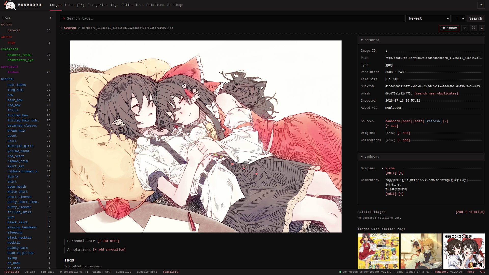

Every image can carry a record of where it came from and what you know
about it. All of it is edited from rows on the detail page, in the right side panel and below the
image.

## Sources

A source is a link to where the image exists online - a booru post, an
artist page. An image can carry several; monloader pushes and
[lookups](../lookup/index.md) add them automatically, and **[+ add]**
records one by hand.

Each source row offers **[open]** (visit the URL), **[edit]**,
**[refresh]** (re-pull the post's tags, commentary and notes through
monloader - see [Lookup](../lookup/index.md)), and **[x]** to remove
it. **[set primary]** picks the source that search's `source:` filter
labels and batch refresh follow first.

A source expands into its own panel holding two more fields pulled
from booru posts (or edited by hand):

- **Original** - the artist's own upload the booru post points at
  (a pixiv or twitter link, typically).
- **Commentary** - the artist's title and description as the booru
  recorded them.

## Original source

Separate from per-source originals, the image itself has one
**Original source** field (shortcut `e o`) for the canonical origin
you want to remember, whatever the source rows say.

## Personal note

A free-text note on the image, for you only (shortcut `e n`).

## Annotations

Annotations are positioned boxes drawn on the image with a text each (the way boorus annotate translation bubbles). Booru lookups import the
post's notes as annotations; you can also draw your own from the
detail page. They render as hover overlays on the image.

## Setting sources in bulk

The gallery's Actions chooser and the selection batch bar both carry a
**Set source** action: it files (or removes) a source label across the
whole search or selection - useful after a bulk import from one site.
