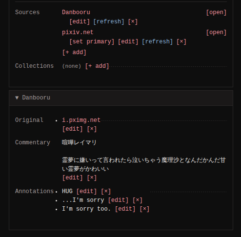
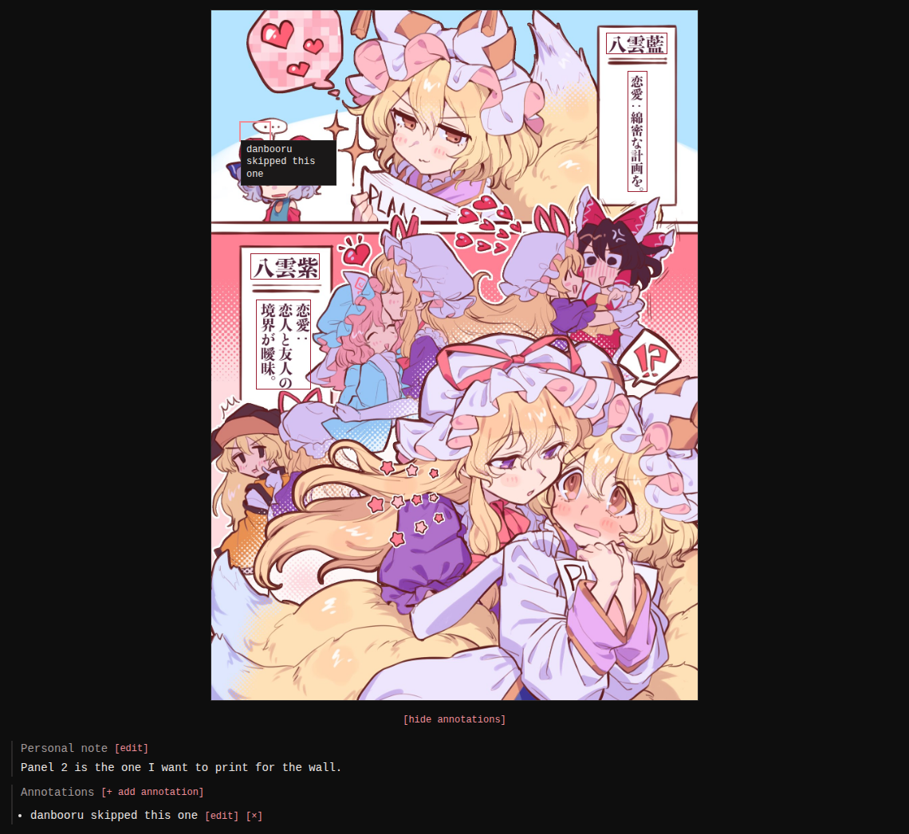

Every image can carry a record of where it came from and what you know
about it, edited from the detail page.

## Sources

A source is a link to where the image exists online - a booru post, an
artist page. An image can carry several; monloader pushes and
[lookups](../lookup/index.md) add them automatically, and **[+ add]**
records one by hand.

Among the row actions, **[refresh]** re-pulls the
post's tags, commentary and notes through monloader, **[upgrade]**
(shown when the source serves a different file than your local copy)
replaces the file in place - both covered in
[Lookup](../lookup/index.md#running-lookups-from-monbooru) - and
**[set primary]** picks which source leads the list and provides the
image's headline source label.

A source expands into a panel with two more fields pulled from booru
posts (or edited by hand): **Original**, the artist's own upload the
booru post points at (a pixiv or twitter link, typically), and
**Commentary**, the artist's title and description as the booru
recorded them.

## Personal note

A free-text note on the image, for you only (shortcut `e n`).

## Annotations

Annotations are positioned boxes drawn on the image with a text each
(the way boorus annotate translation bubbles). Booru lookups import
the post's notes as annotations; you can also draw your own from the
detail page. They render as hover overlays on the image.

The note and your own annotations sit under the image; annotations a
booru lookup pulled in stay on their source's panel. Hovering an
annotation in either list highlights its box on the image, and
**[hide annotations]** clears the overlay.

## Which sources gave a tag

When more than one source agreed on the same tag - say you added it
and a later booru refetch confirmed it, or a PTR lookup pulled it in
too - the tag shows a small **·N** beside it in the sidebar. Hover it
to see every source and the date it last confirmed the tag.

Switching the sidebar to **[sources]** lays the same information out
the other way: one group per source, with a tag several of them agree
on listed under each. See [Tags](../tags/index.md#reading-an-images-tags).

A refetch never deletes tags. When a source stops listing a tag it
contributed earlier, the tag stays where it is, struck through and
marked `stale`, so you can see it is no longer part of that source's
current state and drop it yourself if you agree; a `remove all` link
at the bottom of the list clears every stale tag at once. If a later
refetch lists it again, the mark goes away.
