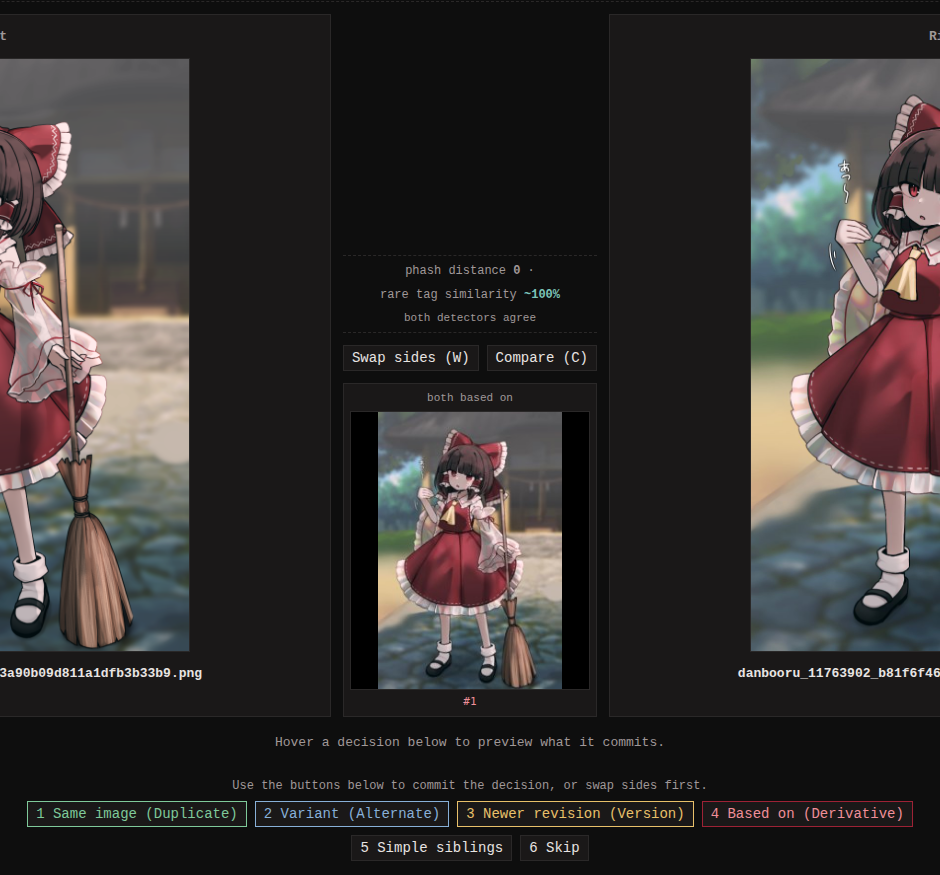

Relations record how two images relate: same picture in two files,
same subject drawn twice, an edit and its original. monbooru tracks
four declared relation types, plus a rejection list:

| Type | Meaning |
|---|---|
| Duplicate | Same image, different files. Members form a group with one chosen **original** (the canonical copy). |
| Alternate | Same subject, different rendering. Unranked group; no member is privileged. |
| Version | A directed parent -> child link, earlier to newer. Each image has at most one parent and one child, so versions form a strict chain. |
| Derivative | A directed source -> derivative link. A derivative has exactly one source; a source can carry many derivatives. |
| Not related | A rejected pair, recorded so the pair finder never suggests it again. |

Declare a relation by hand with **Add a relation** on any detail
page. When monloader pushes a booru post that declares a parent post,
the pair is linked automatically as a derivative once both are in the
gallery.

[Collections](../collections/index.md) are a separate, lighter grouping
mechanism outside the relation graph.

## Finding candidate pairs

monbooru computes a perceptual hash (a fingerprint of what the image
looks like, one that survives resizing and re-encoding) for every
image and uses it to suggest near-duplicate pairs. New images are
probed as they arrive, **Relations -> Find new pairs** scans
everything added since the last scan, and a nightly pass can be
scheduled under **Settings -> Schedule**. If older images predate
perceptual hashing, run **Settings -> Maintenance -> Compute
perceptual hashes** once to backfill.

**Settings -> Relations -> pHash matching distance** (default 4,
range 0..12) sets how different two images may be and still get
paired; lower means fewer, more confident pairs. Saving a stricter
setting also drops the queued pairs it rules out, so a session never
asks about candidates the current settings would not have found.
Loosening a setting takes effect the next time **Find new pairs**
runs.

Pairs whose two images share a collection are left out of the queue -
the collection already relates them. A per-collection **find
relations** switch on the Collections page opts a collection back in.

Archives (cbz/zip) are never paired by image: a book's perceptual
hash is only its cover page, so a cover match says nothing about the
pages inside. They are matched by shared tags instead; byte-identical
copies still show up under **Duplicate files**.

### Pairs that share rare tags

A perceptual hash cannot see that a recolour, a redraw or a fan piece
belongs with its original: the pixels are too different. Tags can.
With **Settings -> Relations -> Also queue pairs that share rare
tags** on (the default), every find-pairs run does a second pass that
scores images against each other by the tags they have in common,
weighting rare tags heavily. It costs a full pass over the library on
every run and only pays off once your images are tagged, so turn it
off if your library is large and mostly untagged.

**Rare tag similarity match strength** sets the bar for queueing a
pair: the default 85% keeps the queue to the pairs worth a decision;
lower it toward 70% to catch more variants at the cost of a longer
queue. Try `similar:<id>~0.85` in the search bar to get a feel for a
level in your library (a related but different score: [`similar:`](../searching/index.md#images-with-similar-tags)
counts every shared tag equally instead of weighting rare ones).

A pair also needs ten meaningful tags in common before it is queued.
Two images can share a character and an artist and nothing else,
which scores high on very little evidence; the floor keeps those out.
Tags carried by a large share of the library do not count, and
neither do tags that arrived through an implication.

## The swipe session

**Relations -> Start a session** walks the queue pair by pair: decide
each pair or skip it. Skipped pairs sit out until **Relations ->
Reset skipped** brings them back. Confident pixel matches come first,
tag matches after.

The line between the two images says what put the pair in front of
you: the pHash distance, the rare tag similarity (with the shared
tags that produced the score listed in the comparison table), both
when the two detectors agree, or **reopened by you**. On a pHash
match the larger file goes on the left; on a tag match the older
image does.

When the two images both descend from the same image - common after a
booru import brings in a parent and its children - that nearest
shared ancestor is shown between them. The pair is still asked about
because two images from one tree can be duplicates of each other, but
the rejection is recorded as **Simple siblings** instead of
**Not related**: the same decision, labeled for this case. Pairs the tree
already answers - one image descends from the other, or both sit in
one revision chain - never reach a session at all. If a tree turns
out to be wrong, unlink the edge and the pair becomes a candidate
again.

Marking a pair a duplicate asks whether to delete the duplicate's
file. When the duplicate carries tags the original lacks, the prompt
also offers **Copy unique tags onto the original first** - the copy
runs either way, so you can consolidate the tags and still keep both
files.

Two pickers above the pair shape the session. **Found by** narrows
the queue to one detector, so you can clear the pixel matches in one
sitting and leave the tag matches for later; it resets to **Both**
each new sitting. **Order** switches between smallest distance first,
largest file first (handy when merging into the best-quality
original), and random; the default for new sessions is set under
**Settings -> Relations**.

## Browsing what you declared

**Relations -> Browse relations** lists every declared relation, one
tab per type - including **Not related**, so a rejected pair can be
found and undone. From here you can unlink an edge, dissolve a group,
and merge same-image groups into one.

**Review again** undoes one decision and sends that pair straight
back to a session. On a longer chain or tree there is no single pair
to reopen, so each image in the card carries its own: it reopens the
link between that image and the one it hangs under, and the rest of
the tree stays as it is.

## Cleaning up duplicates

Two cleanup tools live under **Relations -> Duplicates**, and they
are deliberately separate:

- **Duplicate images** walks the declared duplicate groups - two
  distinct images you marked as the same picture. Deleting removes
  the non-original member; **Copy tags** previews and layers the
  duplicate's tags onto the original first.
- **Duplicate files** walks byte-identical files stored at more than
  one path on disk - already a single image in monbooru. Deleting
  removes the extra path and its file, keeping the canonical one.
