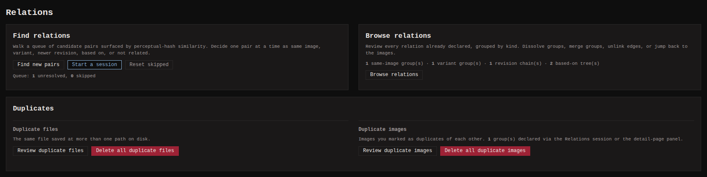
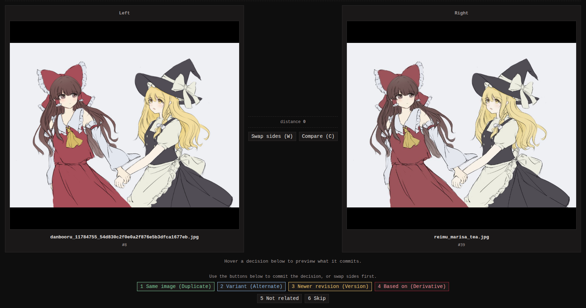

Relations record how two images relate: same picture in two files,
same subject drawn twice, an edit and its original. monbooru tracks
four declared relation types, plus a rejection list:

| Type | Meaning |
|---|---|
| Duplicate | Same image, different files. Members form a group with one chosen **original** (the canonical copy). |
| Alternate | Same subject, different rendering. Unranked group; no member is privileged. |
| Version | A directed parent -> child link, earlier to newer. Each image has at most one parent and one child, so versions form a strict chain. |
| Derivative | A directed source -> derivative link. A derivative has exactly one source; a source can carry many derivatives. |
| Not related | A rejected pair, recorded so the pair finder never suggests it again. |

Declare a relation by hand with **Add a relation** on any detail page
(if the pair already carries one, **Overwrite existing relation**
replaces it). The dialog spells the types out in plain words: "Same
image (Duplicate)", "Variant (Alternate)", "Newer revision (Version)",
"Based on (Derivative)". Related images render in their own panel on the detail
page. When monloader pushes a booru post that declares a parent post,
the pair is linked automatically as a derivative once both are in the
gallery.

[Collections](../collections/index.md) are a separate, lighter grouping
mechanism outside the relation graph.

## Finding candidate pairs

monbooru computes a perceptual hash (a fingerprint of what the image
looks like, one that survives resizing and re-encoding) for every
image and uses it to suggest near-duplicate pairs. The queue of
suggestions fills from several triggers:

- **Automatically on ingest** (the default; turn off with
  `relations.incremental_on_ingest = false` in the config file): each
  new image is probed against the index as it arrives, so fresh candidates appear on their
  own.
- **Relations -> Find new pairs** scans images added since the last
  scan.
- **Settings -> Schedule -> Find relation pairs** runs a nightly pass
  (off by default).
- **Settings -> Maintenance -> Rebuild pair queue** wipes the queue,
  including skipped pairs, and rescans from scratch.
- **Relations -> Reset skipped** returns previously skipped pairs to
  the queue without a rebuild.

How different two images may be and still get paired is set by
**Settings -> Relations -> Find-pairs default distance** (default 4,
range 0..12); lower means fewer, more confident pairs. If older images
predate perceptual hashing, run **Settings -> Maintenance -> Compute
perceptual hashes** once to backfill.

Pairs whose two images share a collection are left out of the queue by
default - the collection already relates them. A per-collection
**find relations** switch on the Collections page opts a collection
back in.

## The swipe session

**Relations -> Start a session** walks the queue pair by pair. Each
pair renders side by side with the Hamming distance (how close the
fingerprints are) and the larger file on the left (bigger usually
means more canonical). Decide the pair (duplicate, alternate, version,
derivative, not related) or skip it; deciding also drops the pair's
co-grouped rows so the session moves straight on. A metadata table
compares the pair underneath; `W` swaps the two sides and `C` opens a
compare slider.

Session order is set under **Settings -> Relations**: smallest
distance first (default, most confident first), largest file first
(handy when merging into the best-quality original), or random.

## Browsing what you declared

**Relations -> Browse relations** lists every declared relation, one
tab per type - Same image, Variants, Revision history, Based on, and
Not related (so a rejected pair can be found and undone). Rows sort by
most recent, size, or when the original was added. From here you can
unlink an edge, dissolve a group, and merge same-image groups by
selecting several and merging them into one.

## Cleaning up duplicates

Two cleanup tools live under **Relations -> Duplicates**, one per
kind of duplicate:

- **Duplicate images** walks the declared duplicate groups. Each row
  shows the original and one other member; **Delete** removes the
  non-original from the gallery, and **Copy tags** (a separate step)
  previews and layers the duplicate's tags onto the original first.
  **Delete all duplicate images** removes every non-original member of
  every group in one go.
- **Duplicate files** walks byte-identical files stored at more
  than one path on disk - one image in the library, several copies in
  the folder. **Delete** removes the extra path and its file, keeping
  the canonical one; **Delete all duplicate files** runs it across
  every alias.

They are deliberately separate: a SHA-256 duplicate is the same file
twice on disk (already a single image in monbooru), while a marked
duplicate is two distinct images you declared to be the same picture.
