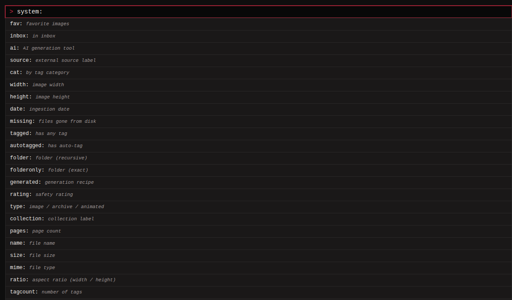

Everything in the search bar is a space-separated list of terms:
plain tags, negated tags, and `key:value` filters. All terms must
match (AND) unless you use `OR`. Searches are case-insensitive.

A few rules that apply everywhere:

- Images whose file is missing from disk are hidden unless the query
  contains `missing:true`.
- Numeric and date filters accept comparisons (`>`, `<`, `>=`, `<=`,
  `=`) and ranges: `X..Y` (inclusive), `..Y`, `X..`.
- A `key:value` term whose key is not a known filter is treated as a
  category-qualified tag search, so `character:midna` works even
  though `character` is not a filter keyword.
- Type `system:` in the search bar to get this whole reference as a
  live dropdown, with drill-down hints per filter.

## Basics

| Query | Meaning |
|---|---|
| `tagname` | Images with this tag. |
| `-tagname` | Exclude images with this tag (`NOT tagname` also works). |
| `tagA tagB` | Images with both tags (AND). |
| `tagA OR tagB` | Images with either tag. |
| `red*` | Wildcard: tags starting with "red" (red_hair, red_eyes, ...). |
| `*hair` | Tags ending in "hair". |
| `*hair*` | Tags containing "hair". |

## Tags and categories

Tags live in categories (`general`, `character`, `artist`,
`copyright`, `meta`, `rating`, `medium`, `person`, `year`, `species`, plus any
you create).

| Query | Meaning |
|---|---|
| `character:tagname` | The tag "tagname" in the "character" category specifically. |
| `cat:character` | Images with any tag in the given category. |
| `tagged:true` / `tagged:false` | Images with at least one tag / with no tags. |
| `autotagged:true` / `autotagged:false` | Images with at least one auto-tag / with none. |
| `stale:any` / `stale:none` | Images that carry any tag a source dropped on its last refresh / none. `stale:tagname` narrows to one dropped tag; `-stale:tagname` excludes it. |
| `tagcount:>=10` | Number of tags on the image. |
| `rating:explicit` | Filter by rating: `general`, `sensitive`, `questionable`, `explicit`. |

`rating:X` matches images whose highest rating is exactly X. An image
carrying both `general` and `explicit` matches `rating:explicit` only.
See [Tags](../tags/index.md) for how ratings and the SFW ceiling work.

## File filters

| Query | Meaning |
|---|---|
| `name:vacation` | Substring match against the filename only (folder names do not bleed in). |
| `size:>=10MB` | File size. Bare bytes or a unit suffix `B`/`KB`/`MB`/`GB`/`TB` (1024-based). |
| `mime:png` | File type: a bare bucket (`png`, `jpeg`, `webp`, `gif`, `mp4`, `webm`, `cbz`) or `image/...` / `video/...`. Comma-separate for a union. |
| `type:image` / `type:archive` / `type:animated` | File-type bucket: `image` = jpeg/png/webp, `archive` = cbz/zip, `animated` = gif/mp4/webm. Comma-separate for a union. |
| `width:>=1920` | Image width in pixels. |
| `height:<768` | Image height in pixels. |
| `ratio:>=1.5` | Aspect ratio (width divided by height). |
| `duration:>=30` | Video duration in seconds. Non-video rows never match. |
| `pages:>=100` | Page count of a comic archive. Non-archive rows count as 0 pages. |
| `hash:abcd...` | Exact match on the image's SHA-256. |
| `id:123` | Exact match on the image id. |
| `missing:true` | Images whose file is missing from disk. |

## Folder, source, collection

| Query | Meaning |
|---|---|
| `folder:path/to` | Images in that folder or any subfolder beneath it. |
| `folderonly:path/to` | Only images directly in that folder, no subfolders. Bare `folderonly:` means the gallery root alone. |
| `folder:"path with spaces"` | Quote paths that contain spaces. |
| `source:"source name"` | Images carrying that source. An image can have several sources; this matches any of them. |
| `source:none` | Images with no source at all. Bare `source:` means the same; `source:any` matches images carrying at least one. |
| `collection:"collection name"` | Images filed under that collection. Bare `collection:` matches images in no collection; `collection:any` matches images in at least one. |
| `via:upload` | How the image was added: `ingest` (watcher or sync), `upload` (web form), `monloader` (pushed by a paired monloader), or any origin an API client supplied. |

## AI and generation metadata

See [AI metadata](../ai-metadata.md) for what monbooru extracts.

| Query | Meaning |
|---|---|
| `ai:any` | Any AI-generated image (A1111 and/or ComfyUI metadata present). |
| `ai:a1111` | Generated with A1111/Forge (`ai:sd` is an alias). |
| `ai:comfyui` | Generated with ComfyUI. |
| `ai:none` | No detected generation metadata. |
| `generated:abcd1234abcd` | Other images sharing the same generation recipe; the hash is shown in the Generation data block on the detail page. |
| `prompt:cat` | Substring match across the SD or ComfyUI prompt. |
| `model:sdxl` | Substring match against the SD model or ComfyUI checkpoint name. |
| `sampler:dpm` | Substring match against the sampler name. |
| `seed:12345` | Exact seed. |

## State

| Query | Meaning |
|---|---|
| `fav:true` / `fav:false` | Favorited / non-favorited. |
| `inbox:true` / `inbox:false` | In the inbox (untriaged) / archived. |
| `date:>2024-01-01` | Ingested after a date. |
| `date:2024-01..2024-06` | Ingested within a range. |
| `date:2024-03-15` | Ingested on an exact date. |
| `date:2024-03-15T19:23..2024-03-15T19:30` | Same, with hour (`THH`), minute (`THH:MM`) or second (`THH:MM:SS`) precision. |

Dates read in your timezone (the `TZ` the app displays timestamps in),
so `date:2024-03-15` means that calendar day where you live, not the
UTC day.

## Relations and perceptual hash

See [Relations](../relations/index.md) for what these mean.

| Query | Meaning |
|---|---|
| `phash:<16hex>` | Exact perceptual-hash match. There is a copy button on the detail page's pHash row. |
| `phash:<16hex>~4` | Within Hamming distance 4 (near-duplicates). Distances 0..64 accepted. |
| `phash:` / `-phash:` | Has a perceptual hash / does not have one. |
| `relation:duplicate` | Image is in any duplicate group. |
| `relation:original` | Image is the chosen original of a duplicate group. |
| `relation:alternate` | Image is in any alternate group. |
| `relation:version` | Image is on a version chain (either side). |
| `relation:derivative` | Image is the derivative end of an edge. |
| `relation:source` | Image is the source side of at least one derivative edge. |
| `relation:collection` | Image belongs to a collection. |
| `relation:any` / `relation:none` | Has any declared relation / none. `any` includes collection membership. |

## Images with similar tags

A perceptual hash finds images that look alike. Tags find images that
are alike in other ways: a recolour, a redraw, or a piece based on
another one shares almost no pixels with its original but plenty of
tags.

| Query | Meaning |
|---|---|
| `similar:1042` | Images sharing at least one meaningful tag with image 1042, closest first. |
| `similar:1042~0.7` | Only the ones scoring 0.7 or better. The score runs 0 to 1. |
| `-similar:1042` | Everything except those. |

The detail page's "Images with similar tags" panel has a
`[more like this]` link that runs the first form for you.

A shared tag counts for more when it is rare. Two images both tagged
`1girl` tell you nothing, because half (all?) your library is; two images
sharing `plaid_scarf` and an unusual pose are probably related. Tags
naming who drew it or who is in it (artist, character, copyright)
count for a little more still. The weights are fixed; the threshold is
the part you tune.

Scores are relative to your own library, so 0.85 has no universal
meaning. You can set the threshold in the settings if you find too many false positives or on the contrary if you don't find enough matches. Tagging your library
uniformly makes scores more consistent.

An image with no tags, or only meta tags, has nothing to match on and
returns nothing.

## Sort options

The sort select sits next to the search bar; the direction select
next to it flips ascending/descending.

| Sort | Meaning |
|---|---|
| Newest | By ingest date, newest first (the default). |
| File size | Largest first. |
| Collection order | Group by collection alphabetically, then by each image's position in it. When the search pins a single `collection:`, results read in that collection's own order. |
| Similarity | Closest tag match first. Appears once a `similar:` search is running, and such a search picks it automatically. |

Random order is its own button next to the search bar (shortcut `R`):
it shuffles the results, stays stable across page turns, and reshuffles
when clicked again. The heart button beside it (shortcut `F`) filters
the current search to favorites.

## Saved searches

To keep a query around, run it, then open the **Actions** chooser next
to the search bar and pick **Save search** (only shown while the
search bar is non-empty). Saved searches appear in the sidebar; click
one to run it, or its x button to delete it. They are per gallery.
