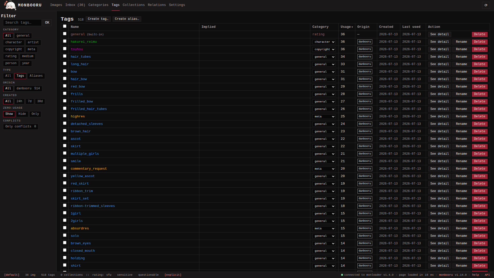

## Adding tags to an image

The tag input sits on the image detail page.

- Type one or more tags separated by spaces and press Add. Each
  whitespace-separated token becomes its own tag.
- Wrap a multi-word tag in double quotes to collapse its spaces to
  underscores: `"red hair"` becomes `red_hair`. Typing `red_hair`
  directly works too.
- Use `category:tagname` to put a tag in a specific category. Quotes
  can follow the prefix: `artist:"john doe"` becomes `john_doe` in the
  `artist` category.
- Example: `artist:"john doe" blue_eyes 1girl` adds `john_doe` as an
  artist tag, and `blue_eyes` and `1girl` as general tags.
- Autocomplete suggestions appear as you type; navigate with the
  up/down arrows and pick with Enter.

Tag names are lowercase and can hold many characters (accented
letters, CJK, Cyrillic, punctuation...), except
space, `"` and `*` (those three belong to the search syntax), up to 200
characters. Spaces fold to underscores; everything else is kept, so
`girls'_frontline`, `fate/grand_order`, and `東方project` work.

To tag many images at once, use **Add tags manually** in the gallery's Actions
chooser (applies to the whole current search) or in the batch bar
(applies to the checked thumbnails). **Remove tags** on the same
surfaces strips tags by name, by source, by auto-tagger, or wholesale.

## The Tags page

The Tags page is the catalog view: every tag, with its category,
usage count and controls.

- **Create tag** declares a fresh tag with no image attached. Useful
  for pre-seeding a vocabulary or wiring implications against names
  you have not used yet.
- **Create alias** binds a name to an existing canonical tag, so
  typing the alias adds the canonical instead. Aliases also resolve in
  searches.
- **Rename** gives a tag a new name, with a checkbox to keep the old
  name as an alias so searches built on the old spelling keep working.
- **Alias to** (selection bar) turns each selected tag into an alias
  of another: the images move to the canonical and the old name
  becomes a zero-usage alias. Selecting an alias row repoints it.
- **Merge** (selection bar) folds the selected tags into one of them:
  pick the survivor in the dialog and the others become its aliases,
  their images moving over.
- **Change category** (selection bar) moves the selection to another
  category. When the name already exists there, an optional merge
  folds the tag into the existing one.
- **Imply** (selection bar) declares "tag X also implies tag Y":
  adding X to an image automatically fans Y out as a dimmed implied
  tag. Implied tags are real tags for search purposes. Implications
  can also be edited on the tag detail page, where each relation
  section (aliases pointing at the tag, implied by, implies) has
  its own inline add. 
- Each row also carries an inline category dropdown for a quick
  recategorization without the dialog.
- **Find aliases and implications** (shown when a paired monloader has
  the Hydrus PTR enabled) pulls each selected tag's known relations from
  the Public Tag Repository into your catalog: aliases pointing at it,
  the tags that imply it, and the tags it implies.
  Selecting all matching tags with no filter active sweeps the whole
  catalog in one background job. Nothing is removed or sent. A re-run
  also reconciles what was pulled before: relations the PTR no longer
  lists stay in your catalog but move under a **stale, added by the
  Public Tag Repository** heading on the tag detail page, so you can
  drop them yourself if you agree. See [Lookup](../lookup/index.md).
  A relation naming a tag you have made an alias of something else is
  skipped and counted in the summary.

The sidebar filters the catalog by category, type, used by, origin,
creation date, conflicts, zero-usage tags (show, hide, or only), stale
usage, and folded duplicates. **Stale** finds tags a source dropped on its last
refresh: **Has stale** for any dropped usage, **Fully stale** for tags
whose every use was dropped (safe to delete). The Usage column shows a
dim `(N stale)` next to the count when some uses are stale.

**Folded duplicates** helps clean up tags an older pull stored folded (before monbooru accepted the full character set) like `fate_grand_order`
where the source really has `fate/grand_order`. Refresh the affected
images so the corrected spelling arrives, run **Find folded duplicates**
from Settings -> Maintenance, then open the filter: it lists each old
spelling next to the corrected tag now superseding it, and **Merge into
corrected spelling** in the selection bar collapses the ones you pick
(the old name stays as an alias).

Back on an image's detail page, **Remove tag(s)** strips tags in bulk
from that one image: all of them, only those a specific source or
auto-tagger applied, or only the stale ones a source dropped.

A row's **See detail** button opens the tag's own page: who applies it
(you, a booru, an auto-tagger), usage over time, aliases pointing at
it, implications in both directions, and its newest images.

Four columns help you audit the catalog: **Origin** shows which
source created each tag (you, a booru site, the PTR, an auto-tagger),
**Used by** every source that has since applied it, **Created** when it
entered the catalog, and **Last used** when it was last applied to an
image. Origin and Used by differ once a tag gets around: a tag danbooru
invented and gelbooru later used reads danbooru under Origin and both
under Used by. The Used by cell keeps to one line, so hover it to read
the full list. The matching **Used by** filter in the sidebar is the
way to ask "what does this booru actually tag with", where the Origin
filter only answers "what did it introduce". The sidebar also filters
by type (tags or aliases) and creation date, and a **Conflicts** filter
lists names that live in more than one category so you can merge the
sides.

Tags are never deleted automatically: removing a tag's last image
leaves the catalog row at zero usage. Delete rows explicitly from the
Tags page when you want them gone.

## The Categories page

**Categories** in the top menu manages the categories themselves: add
your own, rename or delete custom ones, and recolor any of them -
including the built-ins, which are marked "(built-in)" and cannot be
renamed or deleted. There are ten built-ins: general, character,
artist, copyright, meta, rating, medium, person, year, and species.

## Ratings and the SFW ceiling

Each image carries at most one rating tag, from a fixed set ranked
`general < sensitive < questionable < explicit`. Adding a rating by
hand replaces whatever was there, even when the new level ranks below
the old one: your choice always wins, including over an auto-tagger's.

The footer carries the **SFW ceiling**:
`rating: sfw sensitive questionable explicit` (sfw is the display name
for `general`). Click a level to hide every image ranked above it.
The ceiling follows you across pages and applies to gallery browsing,
related images, batch operations on the current search, and auto-tag
runs, so an action scoped to "the current search" can never touch
images you cannot see. When the ceiling actually hides something, the
footer shows an "N hidden images in the current search" indicator.

The footer's library-wide counts (images, tags, collections) stay
unfiltered, so the status bar always reflects the true shape of the
gallery. Setting the ceiling back to `explicit` turns it
off.
